CYO Adventure has twenty-two PostgreSQL tables managed by SQLAlchemy 2 async ORM, with
schema migrations applied as plain SQL via the Supabase CLI (`supabase/migrations/`,
ADR-012; Alembic retired). All timestamps are `TIMESTAMP WITH TIME ZONE`. Enum-like
columns (`role`, `status`, `age_band`) are stored as strings and validated at the
application boundary, which keeps schema migrations simple and avoids enum-type churn.

## Entity-Relationship Diagram

The PlantUML source above (`diagrams/er-diagram.puml`) is authoritative: it carries the
full CHECK constraint list, ON DELETE semantics, and a note on pure-attribution foreign
keys to `user.id` that are deliberately not drawn as edges. The Mermaid version below is a
hand-maintained companion (`diagrams/er-diagram.mmd`) covering the same 22 tables and
relationships, kept for inline rendering directly on GitHub without opening the SVG.

```mermaid
erDiagram
    family ||--o{ user : "has users"
    family ||--o{ child_profile : "has profiles"
    family ||--o{ storybook : "owns"
    family ||--o{ concept : "owns"
    family ||--o{ series : "owns"
    family ||--o{ story_request : "owns"
    family ||--o{ device_grant : "authorizes"
    family ||--o{ family_connection : "opts in as viewer"
    family ||--o{ family_connection : "is connection source"
    user }o--o| child_profile : "child login for"
    series ||--o{ storybook : "has books"
    series ||--o{ story_request : "continuation target"
    storybook ||--|{ storybook_version : "has versions"
    storybook ||--o{ storybook_assignment : "assigned via"
    storybook ||--o{ rating : "rated via"
    storybook ||--o{ story_request : "anchors continuation"
    child_profile ||--o{ reading_state : "reads"
    storybook ||--o{ reading_state : "read as"
    storybook_version ||--o{ reading_state : "pins version"
    child_profile ||--o{ completion : "completes"
    storybook_version ||--o{ completion : "pins version"
    child_profile ||--o{ rating : "rates"
    child_profile ||--o{ storybook_assignment : "assigned to"
    child_profile ||--o{ story_request : "requests"
    concept ||--o{ generation_job : "attempts"
    concept |o--o| story_request : "created on approval"
    user ||--o{ device_grant : "mints"
    family ||--o{ kid_flag : "has flags"
    child_profile ||--o{ kid_flag : "flags"
    storybook ||--o{ kid_flag : "flagged in"
    storybook_version ||--o{ kid_flag : "pins version"

    family {
        uuid id PK
        varchar(200) name
        int monthly_story_quota "NULL = platform default, ADR-015"
        timestamptz created_at
        timestamptz deactivated_at "NULL = active; cascades to members"
    }

    user {
        uuid id PK
        uuid family_id FK
        varchar(16) role "guardian, child, or admin"
        boolean is_admin "capability orthogonal to role"
        varchar(255) authn_subject UK "OIDC sub claim"
        varchar(320) email "NULL; contact only, never identity"
        uuid child_profile_id FK "NULL for guardians and admins"
        timestamptz created_at
        varchar(20) status "pending, active, deactivated, awaiting_approval"
        timestamptz consent_accepted_at "NULL; ADR-018 D1 VPC record"
        varchar(32) consent_policy_version "NULL"
        varchar(200) consent_signer_name "NULL; typed legal-name signature"
        varchar(64) consent_ip "NULL; evidentiary only"
    }

    child_profile {
        uuid id PK
        uuid family_id FK
        varchar(120) display_name
        varchar(16) age_band "3-5, 5-8, 8-11, 10-13, 13-16, 16+"
        float reading_level_cap "default 99.0"
        jsonb allowed_content_flags
        jsonb banned_themes "NULL; G2 guardian theme exclusions"
        boolean tts_enabled
        varchar(255) avatar "NULL"
        text pin_hash "NULL; write-only, never serialized"
        boolean request_auto_approve "ADR-015 G3; default false"
        int monthly_request_envelope "NULL blocks auto-approval"
        timestamptz created_at
        timestamptz deactivated_at "NULL; soft-remove"
        timestamptz processing_restricted_at "NULL; GDPR Art 18/21"
    }

    family_connection {
        uuid id PK
        uuid family_id FK "viewer family, opted in"
        uuid connected_family_id FK "source family"
        uuid created_by FK "NULL; admin who created it"
        timestamptz created_at
        uuid consented_by_viewer_user_id FK "NULL; ADR-016 G17"
        timestamptz consented_by_viewer_at "NULL"
        uuid consented_by_sharer_user_id FK "NULL"
        timestamptz consented_by_sharer_at "NULL"
    }

    series {
        uuid id PK
        uuid family_id FK
        varchar(120) title
        varchar(16) age_band "3-5, 5-8, 8-11, 10-13, 13-16, 16+"
        boolean carries_state "episodic vs stateful, ADR-011"
        uuid created_by FK "NULL"
        timestamptz created_at
    }

    storybook {
        varchar(120) id PK
        uuid family_id FK
        int current_published_version "NULL until first publish"
        varchar(20) status "draft, in_review, needs_revision, published, archived"
        varchar(16) visibility "family (default) or catalog, WS-E"
        uuid created_by FK "NULL"
        uuid series_id FK "NULL for a standalone book"
        int book_index "NULL iff series_id is NULL; UNIQUE with series_id"
        timestamptz created_at
    }

    storybook_version {
        varchar(120) storybook_id PK, FK
        int version PK
        jsonb blob "full Storybook JSON, schema 2.0"
        varchar(512) blob_ref "NULL; reserved MinIO key, Phase 5"
        jsonb validation_report "NULL"
        jsonb moderation_report "NULL"
        uuid approved_by FK "NULL"
        timestamptz published_at "NULL"
        varchar(120) model "NULL; LLM model id"
        varchar(120) prompt_version "NULL"
        varchar(120) provider "NULL; mock, anthropic, openrouter, modal, ollama, import"
        varchar(120) skeleton_slug "NULL; WS-C PR2 provenance"
        timestamptz created_at
        varchar(512) cover_image_url "NULL"
        varchar(20) cover_status "none, generating, ready, failed"
    }

    reading_state {
        uuid child_profile_id PK, FK
        varchar(120) storybook_id PK, FK
        int version "pinned via composite FK to storybook_version"
        varchar(120) current_node
        jsonb var_state "Tier-2 only"
        jsonb path "ordered visited node ids"
        jsonb visit_set "drives once:true effects"
        jsonb save_slots
        int state_revision "server-owned OCC counter"
        varchar(64) last_event_id "NULL; offline-replay idempotency key"
        varchar(64) updated_by_device_id "NULL"
        timestamptz last_synced_at "NULL"
        timestamptz created_at
        timestamptz updated_at
    }

    completion {
        uuid child_profile_id PK, FK
        varchar(120) storybook_id PK
        int version PK
        varchar(120) ending_id PK
        timestamptz found_at
    }

    rating {
        uuid child_profile_id PK, FK
        varchar(120) storybook_id PK, FK
        int value "1-5"
        timestamptz rated_at
        timestamptz updated_at "mutable; re-rate overwrites"
    }

    storybook_assignment {
        uuid child_profile_id PK, FK
        varchar(120) storybook_id PK, FK
        uuid assigned_by FK "NULL = system backfill"
        timestamptz created_at
    }

    device_grant {
        uuid id PK
        uuid family_id FK
        uuid authorized_by FK "guardian who minted the grant"
        varchar(120) label "NULL; guardian-facing device name"
        uuid jti UK "revocation lookup key; token itself not stored"
        timestamptz created_at
        timestamptz revoked_at "NULL while active"
    }

    concept {
        uuid id PK
        uuid family_id FK
        jsonb brief "full ConceptBrief JSON, immutable"
        uuid created_by FK "NULL; guardian who submitted"
        timestamptz created_at
    }

    story_request {
        uuid id PK
        uuid family_id FK
        uuid profile_id FK "NULL for a profile-less request"
        varchar(500) request_text
        varchar(16) status "pending, approved, declined, blocked"
        varchar(16) initiator_role "child (default), guardian, admin"
        varchar(16) age_band
        varchar(16) length "NULL; short, medium, or long"
        varchar(16) narrative_style "prose (default) or gamebook"
        jsonb moderation_flags "NULL; redacted screening findings"
        uuid reviewed_by FK "NULL"
        timestamptz reviewed_at "NULL"
        timestamptz approved_at "NULL; ADR-015 spend derivation"
        uuid concept_id FK "NULL; set on approval"
        uuid series_id FK "NULL; WS-B PR3 continuation"
        varchar(120) anchor_storybook_id FK "NULL; soft-continuation source"
        varchar(120) proposed_series_title "NULL"
        timestamptz created_at
    }

    generation_job {
        uuid id PK
        uuid concept_id FK
        varchar(20) status "queued, running, passed, needs_review, failed, awaiting_manual_fill"
        varchar(120) model "NULL"
        varchar(120) provider "NULL"
        varchar(120) prompt_version "NULL"
        jsonb report "NULL; full GenerationOutcome JSON"
        jsonb authoring_metadata "NULL; skeleton-fill metadata"
        varchar(120) storybook_id "NULL; NOT a FK, see note below"
        int version "NULL"
        varchar(512) error "NULL"
        timestamptz created_at
        timestamptz updated_at
    }

    moderation_threshold {
        uuid id PK
        varchar(16) age_band
        varchar(64) category
        varchar(16) min_verdict "advisory, flag, or block"
        float min_score "NULL; 0.0-1.0 floor"
        uuid updated_by FK "NULL"
        timestamptz updated_at
    }

    moderation_threshold_audit {
        uuid id PK
        varchar(16) age_band
        varchar(64) category
        varchar(16) action "upsert or delete"
        varchar(16) old_min_verdict "NULL"
        varchar(16) new_min_verdict "NULL"
        float old_min_score "NULL"
        float new_min_score "NULL"
        uuid changed_by FK "NOT NULL"
        timestamptz changed_at
    }

    moderation_setting {
        varchar(64) key PK "e.g. admin_noise_floor"
        float value "0.0-1.0"
        uuid updated_by FK "NULL"
        timestamptz updated_at
    }

    pipeline_event {
        uuid id PK
        timestamptz occurred_at
        uuid actor_id FK "NULL iff actor_role is system"
        varchar(16) actor_role "system, guardian, child, admin, or device"
        varchar(32) entity_type "story_request, storybook, series, etc."
        varchar(255) entity_id
        varchar(48) event_type "one of 20 lifecycle event types"
        varchar(32) from_state "NULL"
        varchar(32) to_state "NULL"
        jsonb payload "PII-free, allowlisted fields only"
    }

    provider_model_allowlist {
        uuid id PK
        varchar(32) provider "anthropic, openrouter, modal, or ollama"
        varchar(120) model_id
        boolean enabled "default true"
        varchar(120) display_name "NULL"
        uuid created_by FK "NULL"
        uuid updated_by FK "NULL"
        timestamptz created_at
        timestamptz updated_at
    }

    provider_model_allowlist_audit {
        uuid id PK
        varchar(32) provider
        varchar(120) model_id
        varchar(16) action "create, update, or delete"
        boolean old_enabled "NULL"
        boolean new_enabled "NULL"
        uuid changed_by FK "NOT NULL"
        timestamptz changed_at
    }

    kid_flag {
        uuid id PK
        uuid family_id FK "denormalized from flagging profile"
        uuid profile_id FK
        varchar(120) storybook_id FK
        int version "composite FK to storybook_version"
        varchar(16) reason "did_not_like, scared_me, or confusing"
        varchar(120) node_id "NULL; story-graph node id, never prose"
        timestamptz created_at
        uuid resolved_by FK "NULL while open"
        timestamptz resolved_at "NULL while open"
        varchar(16) resolution "NULL; dismissed, archived_book, or noted"
    }
```

## Table Reference

### `family`

The ownership root. Every other entity is scoped to a family. Family ownership is
checked on every resource access; a valid token for family A cannot reach family B's
data.

| Column | Type | Notes |
| -------- | ------ | ------- |
| id | UUID PK | |
| name | VARCHAR(200) | Display name |
| monthly_story_quota | INT NULL | ADR-015 cost gate: per-family monthly spend ceiling; NULL uses the platform default (`settings.default_monthly_story_quota`), never unlimited. CHECK `ck_family_monthly_story_quota_non_negative` |
| created_at | TIMESTAMPTZ | Server default |
| deactivated_at | TIMESTAMPTZ NULL | Soft-deactivate; cascades to member users/profiles in the same transaction (reactivation is manual, not cascaded) |

### `user`

An authenticated user within a family. `role` is the single base persona
(`guardian`, `child`, or `admin`); the orthogonal `is_admin` flag is a capability, so
one adult can be a guardian, an admin, or both.

| Column | Type | Notes |
| -------- | ------ | ------- |
| id | UUID PK | |
| family_id | UUID FK | family.id |
| role | VARCHAR(16) | `guardian`, `child`, or `admin` |
| is_admin | BOOLEAN | Global admin capability, orthogonal to role; default false. CHECKs keep it off child rows and force it true for the admin role |
| authn_subject | VARCHAR(255) UNIQUE | OIDC `sub` claim; the sole identity key |
| email | VARCHAR(320) NULL | Contact only (Supabase email claim); never an identity key, nullable |
| child_profile_id | UUID FK NULL | child_profile.id; NULL for guardians and admins |
| created_at | TIMESTAMPTZ | |
| status | VARCHAR(20) | `pending` (admin-created invite), `active` (default), `deactivated` (blocks auth; row and history preserved), or `awaiting_approval` (self-signed-up guardian pending admin approval, WS-J) |
| consent_accepted_at | TIMESTAMPTZ NULL | Phase 2 / ADR-018 D1 verifiable-parental-consent timestamp; written once by `api/onboarding.py::_record_consent`, never overwritten |
| consent_policy_version | VARCHAR(32) NULL | Policy version the guardian consented to; paired with `consent_accepted_at` (both NULL or both set) |
| consent_signer_name | VARCHAR(200) NULL | Guardian's typed full-legal-name electronic signature |
| consent_ip | VARCHAR(64) NULL | Evidentiary record of the consenting request's client IP; never queried or joined on |

### `child_profile`

Per-child reading profile. Age band and content caps filter which stories are visible.
`tts_enabled` gates the Web Speech API read-aloud feature.

| Column | Type | Notes |
| -------- | ------ | ------- |
| id | UUID PK | |
| family_id | UUID FK | family.id |
| display_name | VARCHAR(120) | Used in PII screening |
| age_band | VARCHAR(16) | one of `3-5`, `5-8`, `8-11`, `10-13`, `13-16`, `16+` |
| reading_level_cap | FLOAT | Flesch-Kincaid cap; default 99.0 |
| allowed_content_flags | JSONB | Per-flag content permissions |
| banned_themes | JSONB NULL | G2 guardian-set theme exclusions; NULL means none (not `[]`) |
| tts_enabled | BOOLEAN | TTS feature flag |
| avatar | VARCHAR(255) NULL | |
| pin_hash | TEXT NULL | Write-only PIN credential (`pbkdf2_sha256`); never serialized (views expose a `has_pin` bool) |
| request_auto_approve | BOOLEAN | ADR-015 G3 per-child pre-authorization; default false |
| monthly_request_envelope | INT NULL | ADR-015 G3 monthly auto-approve cap; NULL blocks auto-approval (never unlimited). CHECK `ck_child_profile_monthly_request_envelope_non_negative` |
| created_at | TIMESTAMPTZ | |
| deactivated_at | TIMESTAMPTZ NULL | Soft-remove (WS-J); excluded from pickers/listings and session mint, history preserved |
| processing_restricted_at | TIMESTAMPTZ NULL | GDPR Article 18/21 restriction-of-processing marker; distinct from `deactivated_at` (the profile still reads its library and logs in normally, but `api/story_requests.py` refuses a NEW request for it). Set/cleared via `api/profiles.py::update_profile` (guardian-only) |

### `family_connection`

A directional cross-family opt-in for story recommendations (WS-J, ADR-016). `family_id`
is the "viewer" family that opted in to seeing stories sourced from `connected_family_id`;
the relationship is deliberately one-way, so mutual visibility is two rows, not one.
`api/recommendations.py` (K17) is the reader: a connection contributes recommendations
only when both guardians have consented (see the consent columns below).

| Column | Type | Notes |
| -------- | ------ | ------- |
| id | UUID PK | |
| family_id | UUID FK | family.id; the viewer family that opted in |
| connected_family_id | UUID FK | family.id; the source family whose stories may be recommended |
| created_by | UUID FK NULL | user.id of the admin who created the connection |
| created_at | TIMESTAMPTZ | Server default |
| consented_by_viewer_user_id | UUID FK NULL | user.id of the viewer-side guardian who consented (ADR-016 G17); NULL if not (or no longer) consented |
| consented_by_viewer_at | TIMESTAMPTZ NULL | When viewer consent was recorded; paired with the id column (both NULL or both set) |
| consented_by_sharer_user_id | UUID FK NULL | user.id of the sharer-side guardian who consented |
| consented_by_sharer_at | TIMESTAMPTZ NULL | When sharer consent was recorded; paired with the id column |

A unique constraint on `(family_id, connected_family_id)` and a check constraint
`family_id <> connected_family_id` prevent duplicate rows and self-connections. A
connection is active (and contributes to K17 recommendations) only when both consent
id/at pairs are set; either guardian may revoke by clearing their own pair. Two CHECKs
(`ck_family_connection_viewer_consent_pairing`, `ck_family_connection_sharer_consent_pairing`)
enforce the null-pairing, and a partial index `ix_family_connection_active_viewer` backs
the active-viewer lookup.

### `series`

A named, family-owned chain of storybooks (WS-B PR 3, decision B2). DB-level linkage
only: books reference a series via `storybook.series_id`/`book_index`; the embedded
document `Series` metadata block (`storybook/models.py`) is not written, so the
cross-book SR-1..SR-7 validator stays dormant until structural chaining is added.
`carries_state` follows the ADR-011 band rule: `False` (episodic) for `3-5`/`5-8`,
`True` for all higher bands.

| Column | Type | Notes |
| -------- | ------ | ------- |
| id | UUID PK | |
| family_id | UUID FK | family.id (decision B3; widening is WS-E) |
| title | VARCHAR(120) | Guardian- or admin-ratified series title, screened at intake |
| age_band | VARCHAR(16) | one of `3-5`, `5-8`, `8-11`, `10-13`, `13-16`, `16+`; every book in the series must match |
| carries_state | BOOLEAN | ADR-011 band rule |
| created_by | UUID FK NULL | user.id of ratifying user |
| created_at | TIMESTAMPTZ | |

### `storybook`

The lifecycle row for a story. One row per story id, regardless of how many versions
have been generated. `current_published_version` points to the version visible to
children.

| Column | Type | Notes |
| -------- | ------ | ------- |
| id | VARCHAR(120) PK | Stable across versions |
| family_id | UUID FK | family.id |
| current_published_version | INT NULL | NULL until first publish |
| status | VARCHAR(20) | State machine: see below |
| visibility | VARCHAR(16) | `family` (default) or `catalog`; WS-E decision E1/E5 |
| created_by | UUID FK NULL | user.id of guardian who created it |
| series_id | UUID FK NULL | series.id; NULL for a standalone book |
| book_index | INT NULL | 1-based position within the series; NULL iff series_id is NULL |
| created_at | TIMESTAMPTZ | |

**Status values:** `draft`, `in_review`, `needs_revision`, `published`, `archived`
(see `publishing/state_machine.py`). There is no `generating`, `auto_check`, or
`approved` storybook status; staged-generation state lives in `generation_job`, and
publication is the admin approve action.

**Visibility values:** `family` (default, visible only within the owning family) or
`catalog` (browsable/assignable cross-family, WS-E). A unique constraint on
`(series_id, book_index)` and a check constraint pairing `series_id` and
`book_index` (both NULL or both set) enforce series consistency.

### `storybook_version`

An immutable snapshot of a story. Composite primary key `(storybook_id, version)`.

| Column | Type | Notes |
| -------- | ------ | ------- |
| storybook_id | VARCHAR(120) PK FK | storybook.id |
| version | INT PK | Monotonically increasing |
| blob | JSONB | Full Storybook JSON (Phase 1 inline storage) |
| blob_ref | VARCHAR(512) NULL | MinIO object key (reserved, Phase 5) |
| validation_report | JSONB NULL | Gate report at generation time |
| moderation_report | JSONB NULL | Moderation report |
| approved_by | UUID FK NULL | Admin user who approved (global, cross-family) |
| published_at | TIMESTAMPTZ NULL | |
| model | VARCHAR(120) NULL | LLM model id used |
| prompt_version | VARCHAR(120) NULL | Prompt template version |
| provider | VARCHAR(120) NULL | Generation provider (`mock`, `anthropic`, `openrouter`, ...), or `import` for the offline authoring import path; NULL for rows predating this column |
| skeleton_slug | VARCHAR(120) NULL | Production skeleton (`skeletons/<band>/<slug>.json`) this version was filled from, or NULL for fresh generation, an imported book, or a row predating this column (WS-C PR2) |
| created_at | TIMESTAMPTZ | |
| cover_image_url | VARCHAR(512) NULL | AI-generated cover art URL |
| cover_status | VARCHAR(20) | `none` (default), `generating`, `ready`, or `failed` |

At launch the Storybook JSON is stored inline in `blob` (JSONB). The `blob_ref`
column is deferred: it holds the MinIO object key once object storage is wired
(ADR-009 defers MinIO to a future object-store target). The schema is versioned at
`2.0` and validated on read with a reject-on-mismatch check; there is no upcaster,
so a stored blob whose `schema_version` does not match is rejected rather than
migrated (ADR-001).

### `reading_state`

Per-child, per-story reading progress. Composite primary key `(child_profile_id, storybook_id)`.
A composite foreign key `(storybook_id, version)` references `storybook_version` to
prevent saving state for a version that does not exist.

| Column | Type | Notes |
| -------- | ------ | ------- |
| child_profile_id | UUID PK FK | child_profile.id |
| storybook_id | VARCHAR(120) PK FK | storybook.id |
| version | INT | Pinned via composite FK to storybook_version |
| current_node | VARCHAR(120) | Current node id |
| var_state | JSONB | Variable values (Tier-2 only) |
| path | JSONB | Ordered list of visited node ids |
| visit_set | JSONB | Set of visited nodes (drives `once: true` effects) |
| save_slots | JSONB | Named state snapshots |
| state_revision | INT | Server-owned OCC counter |
| last_event_id | VARCHAR(64) NULL | Idempotency key for offline replay |
| updated_by_device_id | VARCHAR(64) NULL | Device that last wrote |
| last_synced_at | TIMESTAMPTZ NULL | |
| created_at | TIMESTAMPTZ | |
| updated_at | TIMESTAMPTZ | `onupdate=func.now()` |

### `completion`

Records that a child found a particular ending of a story version. Composite
primary key `(child_profile_id, storybook_id, version, ending_id)`.

| Column | Type | Notes |
| -------- | ------ | ------- |
| child_profile_id | UUID PK FK | child_profile.id |
| storybook_id | VARCHAR(120) PK | |
| version | INT PK | |
| ending_id | VARCHAR(120) PK | Stable ending id from Storybook |
| found_at | TIMESTAMPTZ | Server default |

### `rating`

A child's 1-5 rating of a storybook. Unlike `completion`, which pins to an
immutable `storybook_version` via a composite FK, a rating is about the *book*
as a whole and is mutable: a child may re-rate, overwriting the prior value.
Composite primary key `(child_profile_id, storybook_id)`.

| Column | Type | Notes |
| -------- | ------ | ------- |
| child_profile_id | UUID PK FK | child_profile.id |
| storybook_id | VARCHAR(120) PK FK | storybook.id |
| value | INT | 1-5, enforced by `ck_rating_value_range` |
| rated_at | TIMESTAMPTZ | Server default |
| updated_at | TIMESTAMPTZ | `onupdate=func.now()` |

### `storybook_assignment`

A guardian's grant of one published story to one child profile. Composite primary
key `(child_profile_id, storybook_id)` so a profile is assigned a book at most once.
This table is the read-gate: the library listing and the direct version fetch both
filter on it, so a child sees only stories explicitly assigned to their profile.

| Column | Type | Notes |
| -------- | ------ | ------- |
| child_profile_id | UUID PK FK | child_profile.id |
| storybook_id | VARCHAR(120) PK FK | storybook.id |
| assigned_by | UUID FK NULL | user.id of granting guardian; NULL for a system backfill |
| created_at | TIMESTAMPTZ | Server default |

### `device_grant`

A guardian-minted, durable, family-scoped device authorization (ADR-014). Lets a
child pick a profile and read, online or offline, without a live guardian Supabase
session on the device: `POST /v1/child-sessions` and `GET /v1/profiles` accept a
verified device grant as an additional authority alongside the guardian/admin
Supabase bearer, scoped to the grant's own `family_id`. The token itself (HS256,
audience `cyo-device-grant`, 90-day expiry) is never stored; only its unique `jti`
and mint metadata are, here.

| Column | Type | Notes |
| -------- | ------ | ------- |
| id | UUID PK | |
| family_id | UUID FK | family.id; the device is authorized for exactly this family |
| authorized_by | UUID FK | user.id of the guardian who minted the grant |
| label | VARCHAR(120) NULL | Guardian-facing device name (e.g. "Kitchen tablet"); never derived from request headers |
| jti | UUID UNIQUE | Matches the token's `jti` claim; the revocation lookup key |
| created_at | TIMESTAMPTZ | |
| revoked_at | TIMESTAMPTZ NULL | `NULL` while active; set (not deleted) on revoke so the guardian-facing device list can show when a device was revoked |

Revocation is enforced online only: the token's `jti` is checked against this
table's `revoked_at` on every use. An already-offline device cannot see a
revocation until it reconnects, an accepted limitation bounded by the 90-day
grant TTL (ADR-014, "Negative / risks"). The signing secret is
`DEVICE_GRANT_SECRET`, validated at startup the same way as `CHILD_SESSION_SECRET`.

### `concept`

The intake form for a guardian's story request. A `ConceptBrief` payload is validated
at the application boundary by the Pydantic model before insertion. Immutable once
written.

| Column | Type | Notes |
| -------- | ------ | ------- |
| id | UUID PK | |
| family_id | UUID FK | family.id |
| brief | JSONB | Full ConceptBrief JSON |
| created_by | UUID FK NULL | Guardian user who submitted |
| created_at | TIMESTAMPTZ | |

### `story_request`

A child's free-text story idea awaiting a guardian or admin decision. The request
text is screened at submission (PII guard + Stage-0 classifiers); a bright-line hit
lands the row in the `blocked` state before any guardian reads the raw text. A
guardian or admin then approves it (which builds a `ConceptBrief`, links
`concept_id`, and enters the generation pipeline) or declines it. `family_id` is
denormalized (stored, not derived from `profile_id`) so the guardian list and the
family-scope authz check stay single-table.

| Column | Type | Notes |
| -------- | ------ | ------- |
| id | UUID PK | |
| family_id | UUID FK | family.id |
| profile_id | UUID FK NULL | child_profile.id; NULL for a profile-less request (WS-B PR 2) |
| request_text | VARCHAR(500) | Child's short free-text idea |
| status | VARCHAR(16) | `pending`, `approved`, `declined`, or `blocked` |
| initiator_role | VARCHAR(16) | `child` (default), `guardian`, or `admin` |
| age_band | VARCHAR(16) | Required at flush, no default; one of `3-5`, `5-8`, `8-11`, `10-13`, `13-16`, `16+` |
| length | VARCHAR(16) NULL | `short`, `medium`, or `long`; NULL before a guardian confirms it |
| narrative_style | VARCHAR(16) | `prose` (default) or `gamebook` |
| moderation_flags | JSONB NULL | Redacted screening findings; never raw classifier score/source |
| reviewed_by | UUID FK NULL | user.id of guardian/admin who decided |
| reviewed_at | TIMESTAMPTZ NULL | |
| approved_at | TIMESTAMPTZ NULL | When the request entered `approved` specifically (ADR-015 spend derivation); distinct from `reviewed_at`; NULL unless approved |
| concept_id | UUID FK NULL | concept.id created on approval |
| series_id | UUID FK NULL | series.id this request continues (WS-B PR 3) |
| anchor_storybook_id | VARCHAR(120) FK NULL | storybook.id this soft continuation follows on from |
| proposed_series_title | VARCHAR(120) NULL | Kid's original series title proposal, retained as audit trail |
| created_at | TIMESTAMPTZ | |

**Status values:** `pending`, `approved`, `declined`, `blocked`.

Check constraints enforce: gamebook narrative style is teen-only (`13-16`/`16+`,
`ck_story_request_style_band`); a request proposes a new series title or continues
via an anchor, never both (`ck_story_request_title_anchor_mutex`); and an anchored
request always carries a `series_id` (`ck_story_request_anchor_requires_series`).

### `generation_job`

Tracks one staged-generation attempt for a concept. Status transitions:
`queued -> running -> passed | needs_review | failed`, plus a sixth state,
`awaiting_manual_fill`, set only for `method="skeleton_fill"` + `mechanism="skill"`
jobs and cleared once the human-authored fill is imported.

| Column | Type | Notes |
| -------- | ------ | ------- |
| id | UUID PK | |
| concept_id | UUID FK | concept.id |
| status | VARCHAR(20) | `queued`, `running`, `passed`, `needs_review`, `failed`, `awaiting_manual_fill` |
| model | VARCHAR(120) NULL | LLM model id |
| provider | VARCHAR(120) NULL | Provider name |
| prompt_version | VARCHAR(120) NULL | |
| report | JSONB NULL | Full `GenerationOutcome` JSON |
| authoring_metadata | JSONB NULL | Skeleton-fill metadata (skeleton_slug, theme_brief, review stage model overrides); NULL for `fresh_generation` jobs |
| storybook_id | VARCHAR(120) NULL | **Not a FK** (see note) |
| version | INT NULL | Storybook version produced |
| error | VARCHAR(512) NULL | Short error on failure |
| created_at | TIMESTAMPTZ | |
| updated_at | TIMESTAMPTZ | `onupdate=func.now()` |

`storybook_id` is intentionally **not a foreign key**. A job may fail before any
`storybook` row is created; a hard FK constraint would block inserting the failure
record. The application layer verifies the storybook row exists independently when
reading this field.

### `moderation_threshold`

Sparse per-`(age_band, category)` override of the moderation surfacing default.
Absence of a row means the code default applies
(`moderation/thresholds.py::DEFAULT_THRESHOLD`). The table is small (admin-curated),
so policy loads read it whole.

| Column | Type | Notes |
| -------- | ------ | ------- |
| id | UUID PK | |
| age_band | VARCHAR(16) | The reader age band this override applies to |
| category | VARCHAR(64) | The moderation category this override applies to |
| min_verdict | VARCHAR(16) | Minimum verdict severity that surfaces to review: `advisory`, `flag`, or `block` |
| min_score | FLOAT NULL | Optional classifier-score floor in [0.0, 1.0]; NULL to use the verdict gate alone |
| updated_by | UUID FK NULL | user.id of admin who last edited |
| updated_at | TIMESTAMPTZ | `onupdate=func.now()` |

A unique constraint on `(age_band, category)` enforces at most one override per pair.

### `moderation_threshold_audit`

Append-only audit of `moderation_threshold` edits (who changed what, when).
Deliberately minimal; the `pipeline_event` log will subsume this role in a future
iteration, so this table stays write-only until then.

| Column | Type | Notes |
| -------- | ------ | ------- |
| id | UUID PK | |
| age_band | VARCHAR(16) | Age band of the edited override |
| category | VARCHAR(64) | Moderation category of the edited override |
| action | VARCHAR(16) | `upsert` or `delete` |
| old_min_verdict | VARCHAR(16) NULL | Verdict floor before the edit; NULL on insert |
| new_min_verdict | VARCHAR(16) NULL | Verdict floor after the edit; NULL on delete |
| old_min_score | FLOAT NULL | Score floor before the edit |
| new_min_score | FLOAT NULL | Score floor after the edit |
| changed_by | UUID FK | user.id of admin who made the edit; NOT NULL |
| changed_at | TIMESTAMPTZ | Server default |

### `moderation_setting`

A single named global moderation scalar. Distinct from `moderation_threshold`: this
table holds global scalars (currently one row, key `admin_noise_floor`, seeded at
`0.05`) rather than sparse per-`(age_band, category)` overrides. It denoises the
admin review surface: `ADVISORY` findings scoring below the floor are hidden;
`BLOCK`/`FLAG` findings and unscored findings always surface regardless.

| Column | Type | Notes |
| -------- | ------ | ------- |
| key | VARCHAR(64) PK | Setting's unique name (e.g. `admin_noise_floor`) |
| value | FLOAT | Constrained to [0.0, 1.0] |
| updated_by | UUID FK NULL | user.id of admin who last edited |
| updated_at | TIMESTAMPTZ | `onupdate=func.now()` |

### `pipeline_event`

Append-only log of every story-lifecycle transition, written from the same
transaction performing the transition. Rows are enforced append-only by a DB
trigger created in the migration; the ORM never updates or deletes them.
`actor_id` is NULL for system transitions (worker, moderation), which carry
`actor_role='system'`. `payload` is PII-free by contract, gated by
`events/writer.py::_PAYLOAD_ALLOWLIST`.

| Column | Type | Notes |
| -------- | ------ | ------- |
| id | UUID PK | |
| occurred_at | TIMESTAMPTZ | Server default |
| actor_id | UUID FK NULL | user.id; NULL iff actor_role is `system` |
| actor_role | VARCHAR(16) | `system`, `guardian`, `child`, `admin`, or `device` (ADR-014; the CHECK constraint's vocabulary is a superset of every valid `Role`, though no event is written with `actor_role='device'` yet, since the device principal is not wired into any event-emitting endpoint) |
| entity_type | VARCHAR(32) | `story_request`, `generation_job`, `storybook`, `storybook_version`, `series`, `storybook_assignment`, `rating`, `moderation_threshold`, `moderation_setting`, `kid_flag`, `user`, `family`, or `family_connection` |
| entity_id | VARCHAR(255) | The affected row's id; composite ids (e.g. `f"{profile_id}:{storybook_id}"`) can reach ~157 chars |
| event_type | VARCHAR(48) | One of 20 lifecycle event types (`request_created`, `request_approved`, `request_declined`, `plan_assigned`, `generation_started`, `generation_finished`, `moderation_completed`, `repair_applied`, `sent_back`, `released`, `threshold_changed`, `noise_floor_changed`, `book_assigned`, `rated`, `user_managed`, `family_managed`, `family_connection_changed`, `kid_flagged`, `flag_resolved`, `node_edited`) |
| from_state | VARCHAR(32) NULL | |
| to_state | VARCHAR(32) NULL | |
| payload | JSONB | PII-free event payload; defaults to `{}` |

### `provider_model_allowlist`

Admin-editable allowlist of `(provider, model_id)` pairs eligible for generation.
Providers are a code-fixed enum (the CHECK constraint); only the model id within a
provider is admin-managed. `mock` is never allowlisted: it is a CI-only test
double, never a real generation backend.

| Column | Type | Notes |
| -------- | ------ | ------- |
| id | UUID PK | |
| provider | VARCHAR(32) | One of `anthropic`, `openrouter`, `modal`, `ollama` |
| model_id | VARCHAR(120) | Provider-native model id (e.g. `claude-sonnet-4-6`) |
| enabled | BOOLEAN | Whether this pair is currently selectable; default true |
| display_name | VARCHAR(120) NULL | Optional human label for a future admin UI |
| created_by | UUID FK NULL | user.id of admin who added this row |
| updated_by | UUID FK NULL | user.id of admin who last edited this row |
| created_at | TIMESTAMPTZ | |
| updated_at | TIMESTAMPTZ | `onupdate=func.now()` |

A unique constraint on `(provider, model_id)` enforces at most one row per pair.
Disabling a row (rather than deleting it) preserves audit history.

### `provider_model_allowlist_audit`

Append-only audit of `provider_model_allowlist` edits (who changed what, when),
mirroring `moderation_threshold_audit`.

| Column | Type | Notes |
| -------- | ------ | ------- |
| id | UUID PK | |
| provider | VARCHAR(32) | Affected row's provider (natural-key half) |
| model_id | VARCHAR(120) | Affected row's model id (natural-key half) |
| action | VARCHAR(16) | `create`, `update`, or `delete` |
| old_enabled | BOOLEAN NULL | `enabled` value before the edit; NULL on create |
| new_enabled | BOOLEAN NULL | `enabled` value after the edit; NULL on delete |
| changed_by | UUID FK | user.id of admin who made the edit; NOT NULL |
| changed_at | TIMESTAMPTZ | Server default |

### `kid_flag`

A child's structured "I didn't like this / this scared me" signal (K15). Feeds the
admin moderation queue (A1) directly and, downstream, a guardian alert feed (G10) as a
`pipeline_event` projection built separately (this table does not itself notify a
guardian). `family_id` is denormalized from the flagging profile (mirrors
`story_request.family_id`) so the admin queue stays single-table. Per ADR-016's
no-free-text principle a flag carries no child-authored prose: `reason` is a closed
vocabulary and `node_id` is a story-graph node id, so there is nothing to moderate
before an adult sees it.

| Column | Type | Notes |
| -------- | ------ | ------- |
| id | UUID PK | |
| family_id | UUID FK | family.id; denormalized from the flagging profile |
| profile_id | UUID FK | child_profile.id; the flagging child |
| storybook_id | VARCHAR(120) FK | storybook.id; also half of the composite FK below |
| version | INT | Storybook version read; composite FK `(storybook_id, version)` -> storybook_version |
| reason | VARCHAR(16) | `did_not_like`, `scared_me`, or `confusing` (`ck_kid_flag_reason`) |
| node_id | VARCHAR(120) NULL | Story-graph node id being read when flagged; never prose |
| created_at | TIMESTAMPTZ | Server default |
| resolved_by | UUID FK NULL | user.id of admin who resolved; NULL while open |
| resolved_at | TIMESTAMPTZ NULL | NULL while open |
| resolution | VARCHAR(16) NULL | `dismissed`, `archived_book`, or `noted` (`ck_kid_flag_resolution`); NULL while open |

A composite foreign key `(storybook_id, version)` references `storybook_version`. Check
constraints enforce the closed `reason`/`resolution` vocabularies and pair
`resolved_by`/`resolved_at` (`ck_kid_flag_resolved_pairing`, both NULL or both set). An
index `ix_kid_flag_resolved_created (resolved_at, created_at)` backs the admin
"open flags" queue.

## Authorization Pattern

Family ownership is checked on every resource. The `Principal` in `api/deps.py` carries
`family_id` and `profile_ids`. Every endpoint calls `authorize_family()` and/or
`authorize_profile()` before touching any row. See
`docs/planning/authorization-matrix.md` for the full access matrix.

## Database Access Control (RLS and Service Roles)

ADR-021 replaces the single shared `postgres` owner-role connection with two
dedicated, least-privilege Postgres roles: `cyo_api` (the FastAPI web process,
`core/database.py::get_session`) and `cyo_worker` (`generation/worker.py`,
`generation/worker_main.py`, `covers/worker.py`, via `get_worker_session`).
`core/config.py::worker_database_url` defaults to `database_url` when unset, so an
environment that has not split credentials yet keeps working unchanged.

Row Level Security, enabled on every application table by
`supabase/migrations/20260711200745_enable_rls_all_tables.sql`, is enforced by explicit
`CREATE POLICY` grants added in
`supabase/migrations/20260720170200_add_service_role_policies.sql` (the roles
themselves are created in `20260720170100_create_service_roles.sql`). This closes the
placeholder the RLS-enable migration's own comment warned about: RLS with no policies
attached is equivalent to no RLS at all for the connecting role. The app-level
authorization above (`Principal`/`authorize_family`/`authorize_profile`) remains the
primary authorization boundary; RLS is defense-in-depth beneath it, not a replacement.
