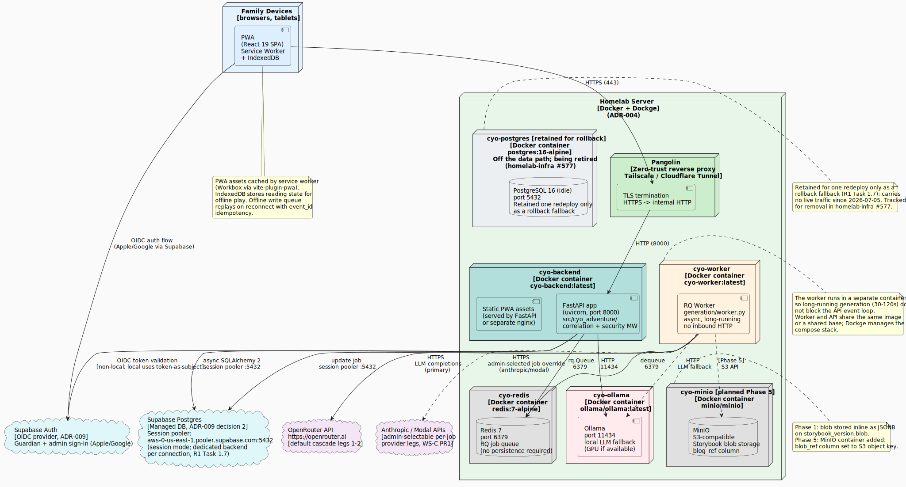

CYO Adventure deploys to a self-hosted homelab using Docker containers orchestrated
by Dockge (ADR-004: homelab-first deployment). External access is secured by Pangolin
zero-trust reverse proxy (Tailscale or Cloudflare Tunnel). Supabase Auth provides OIDC
identity for the guardian, child, and admin roles (ADR-009), and the operational
database is Supabase Postgres, reached through the session pooler (ADR-009 decision 2;
R1 Task 1.7, cut over 2026-07-05).

## Deployment Diagram

## Container Stack

| Container | Image | Purpose |
|-----------|-------|---------|
| `cyo-backend` | `cyo-backend:latest` | FastAPI application (uvicorn, port 8000) |
| `cyo-worker` | `cyo-worker:latest` | RQ generation worker (long-running, no inbound HTTP) |
| `cyo-postgres` | `postgres:16-alpine` | Retained for one-redeploy rollback only; off the data path, tracked for removal in homelab-infra #577 |
| `cyo-redis` | `redis:7-alpine` | Redis 7, port 6379, RQ job broker |
| `cyo-ollama` | `ollama/ollama:latest` | Local LLM fallback, port 11434 |
| `cyo-minio` | `minio/minio` | Object storage, planned Phase 5 |

The backend and worker share the same Python codebase but run as separate containers.
Separating the worker prevents long-running LLM calls (30-120s per story) from
blocking the API event loop.

The operational database itself is **Supabase Postgres** (managed, external to the
homelab), not a container in this stack; `cyo-backend` and `cyo-worker` reach it over
the internet through Supabase's session pooler (`aws-0-us-east-1.pooler.supabase.com:5432`,
session mode). See the Network Architecture section below.

## Network Architecture

All family device traffic enters through **Pangolin**, which terminates TLS and
forwards plain HTTP to the backend container on port 8000. Pangolin runs as its own
container in the stack and handles the zero-trust tunnel to the homelab.

The R1 internal-web deploy (`services/cyo-adventure/` in the separate
`ByronWilliamsCPA/homelab-infra` repo) is a distinct rung from this ADR-004 topology:
there, nginx is the ingress point on `docker-host`, reverse-proxying `/api` to the
FastAPI container internally rather than Pangolin forwarding to it directly. See the
`frontend/nginx.conf` `location /api/` block.

Internal container-to-container communication uses Docker's bridge network:

- `cyo-backend` -> `cyo-redis` (RQ enqueue, port 6379)
- `cyo-worker` -> `cyo-redis` (job dequeue, port 6379)
- `cyo-worker` -> `cyo-ollama` (LLM fallback, port 11434)
- `cyo-worker` -> OpenRouter API (HTTPS, egress to internet, primary LLM)

Egress to the managed database (not on the Docker bridge network):

- `cyo-backend` -> Supabase Postgres (async SQLAlchemy, session pooler, port 5432)
- `cyo-worker` -> Supabase Postgres (job status updates, session pooler, port 5432)

`cyo-postgres` is retained in the compose stack only as a one-redeploy rollback
fallback; it carries no live traffic (tracked for removal in homelab-infra #577).

## PWA Delivery

The React 19 PWA is built as static assets and served by the backend container (or
a co-located nginx, which can also reverse-proxy `/api` when nginx is the deploy's
ingress point; see the Network Architecture note above). A Workbox service worker
(via `vite-plugin-pwa`) caches assets for offline use. IndexedDB (`offline/db.ts`)
caches reading state locally so children can continue reading without a network
connection.

## Phase 1 vs Phase 5 Storage

**Phase 1 (current):** Storybook JSON is stored inline as `JSONB` in the
`storybook_version.blob` column. No object storage is needed.

**Phase 5 (planned):** The MinIO container is added to the stack. The
`storybook_version.blob_ref` column is set to the MinIO S3 object key. The `blob`
column is kept for backward compatibility with rows written in Phase 1.

## Environment Configuration

All secrets and environment-specific values are loaded from environment variables
via `core/config.py` (Pydantic Settings). The `model_validator` in `config.py`
raises `ConfigurationError` if the localhost-only development database URL is
detected in a non-local environment, preventing accidental credential leakage.

## Authentication Flow

**Production:** The PWA initiates an OIDC authorization code flow with Supabase Auth
(ADR-009). The resulting access token is sent as a `Bearer` header with every API
request. Outside the `local` environment the backend verifies the token signature via
`jwt.PyJWKClient` (JWKS fetched from `OIDC_JWKS_URL`), plus issuer, audience, and
expiry (`_verify_oidc_jwt` in `api/deps.py`). Supabase is reached through the
provider-agnostic `oidc_*` config, so no Supabase SDK is imported.

**Development seam:** in the `local` environment only, `api/deps.py` uses a
`_extract_subject()` stub that treats the raw bearer token as the verified OIDC
subject without signature validation. A `#CRITICAL: security` guard raises
`ConfigurationError` at import time if the environment is non-local and
`OIDC_ISSUER`/`OIDC_JWKS_URL` are unset, so the stub can never be active outside
local development.

## Container Images

Container images are pinned by tag, never `latest` in production (per `CLAUDE.md` and
ADR-004). The `cyo-backend:latest` and `cyo-worker:latest` tags above denote the local
development convention; CI produces versioned tags aligned with SemVer releases.

## Observability

- **Structured logging:** `utils/logging.py` (structlog) emits JSON logs with
  correlation IDs injected by `CorrelationMiddleware`.
- **Sentry:** error tracking (planned; configurable via `settings.sentry_dsn`).
- **Correlation IDs:** every request carries `X-Correlation-ID`; the header propagates
  into all log lines for the request lifecycle.

## Related ADRs

- ADR-004: [Homelab-First Deployment](../planning/adr/adr-004-homelab-first-deployment.md)
- ADR-002: [Client: Progressive Web App](../planning/adr/adr-002-client-pwa.md)
- ADR-003: [Frontier LLM Story Generation](../planning/adr/adr-003-frontier-llm-generation.md)
