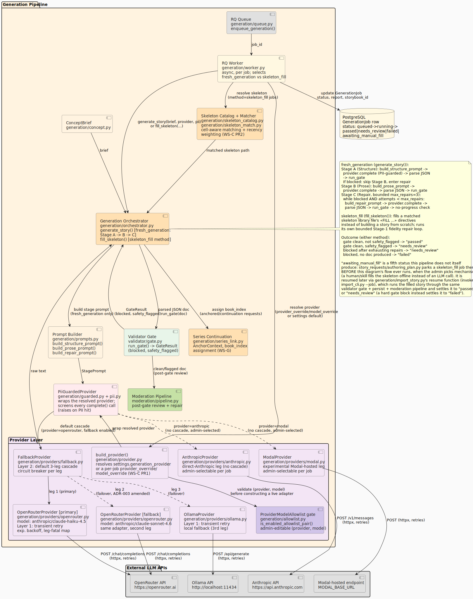
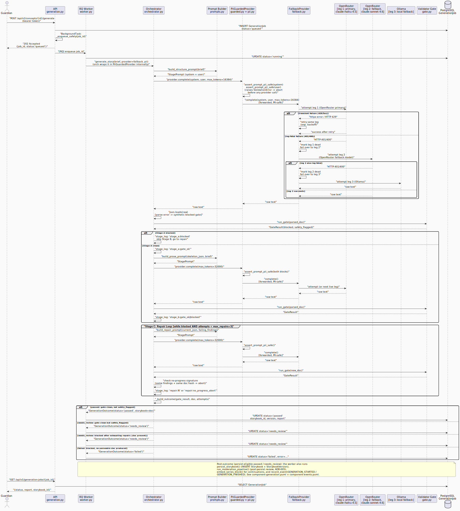

CYO Adventure generates stories through a three-stage pipeline that turns a
guardian-authored `ConceptBrief` into a validated `Storybook` JSON document.
The pipeline runs asynchronously in an RQ worker process so long-running LLM
calls do not block the API.

## Component View

## Generation Sequence

The sequence below traces the full lifecycle from a guardian POST to job completion,
matching the `generate_story()` docstring in `generation/orchestrator.py` exactly.

## Stage Pipeline (Structure -> Prose -> Repair)

The orchestrator (`generation/orchestrator.py`) drives three stages:

### Stage A: Structure

1. `build_structure_prompt(brief)` assembles a `StagePrompt` (system + user blocks).
2. `assert_prompt_pii_safe()` runs on **both** blocks before any external call. A real
   child's display name in the brief text aborts generation with `ValidationError`;
   the provider is never called.
3. `provider.complete()` calls the LLM (via `FallbackProvider`).
4. `json.loads(raw)` parses the response; a non-dict or parse error synthesizes a
   blocked gate result (`L1-1` finding) without raising.
5. `run_gate(doc)` validates the structure.

If Stage A is **blocked**: skip Stage B and go directly to the repair loop.
If Stage A is **clean**: proceed to Stage B.

### Stage B: Full Prose

Same flow as Stage A but using `build_prose_prompt(skeleton_json, brief)` and a higher
`max_tokens` ceiling (32,000). The Stage A skeleton is passed so the LLM expands it
with full narrative prose without restructuring the graph.

### Stage C: Bounded Repair Loop

While the gate is blocked and `attempts < max_repairs` (default 3):

1. `build_repair_prompt(current_json, failing_findings)` targets the ERROR-severity
   findings by rule ID and message.
2. PII guard runs again.
3. `provider.complete()` returns a repaired document.
4. Gate runs on the new document.
5. **No-progress check**: if the set of ERROR findings AND the SHA-256 hash of the
   document are identical to the previous attempt, further repairs cannot help and the
   loop aborts early (`repair:no_progress_abort`).

### Outcome Mapping

| Gate result | Doc present | Outcome |
|-------------|-------------|---------|
| clean, not safety_flagged | yes | `"passed"` |
| clean, safety_flagged | yes | `"needs_review"` |
| blocked after exhausting repairs | yes | `"needs_review"` |
| blocked, no doc produced | no | `"failed"` |

## Provider Fallback Cascade

The provider is a three-layer failure model:

**Layer 1 (per adapter):** Each `OpenRouterProvider` or `OllamaProvider` retries
transient failures (connection errors, HTTP 429, HTTP 5xx) against the **same** model
with exponential backoff. Leg-fatal errors (HTTP 401/400/402 for OpenRouter) are not
retried.

**Layer 2 (`FallbackProvider`):** The cascade holds an ordered list of legs. On a
`ProviderError` from one leg, it fails over to the next. Leg-fatal errors mark the
leg dead for the rest of the run (circuit breaker). A global per-run attempt cap
(default 30) prevents pathological retry storms.

**Layer 3 (orchestrator repair loop):** A gate-blocked but valid response is a
**content** failure, not a provider failure. The repair loop handles it; `FallbackProvider`
never sees it as an error.

**PII invariant:** The orchestrator runs `assert_prompt_pii_safe()` before every
`provider.complete()` call. A `ValidationError` from the PII guard propagates straight
through `FallbackProvider` uncaught (only `ProviderError` is caught). This means a PII
violation can never be retried or failed over.

## Guardian-Only Authoring Endpoints

All four generation endpoints (`POST /concepts`, `POST /concepts/{id}/generate`,
`GET /generation-jobs/{id}`, `POST /storybooks/{id}/versions/{v}/validate`) require the
guardian role. Child tokens receive 403 immediately before any DB access.

`POST /concepts` screens the brief text for real child display names (fetched from
`child_profile.display_name` for the family) before persisting the `Concept` row.

`POST /concepts/{id}/generate` creates a `GenerationJob` row (`status='queued'`) and
schedules a **background task** to enqueue it on Redis. Running the enqueue after the
commit ensures the worker never races a not-yet-durable row. If Redis is unreachable,
the row is still created and a 202 is returned (the job can be recovered by a sweeper).

## Key Source Files

| File | Purpose |
|------|---------|
| `src/cyo_adventure/generation/orchestrator.py` | `generate_story()`: the three-stage pipeline |
| `src/cyo_adventure/generation/prompts.py` | `build_structure/prose/repair_prompt()` |
| `src/cyo_adventure/generation/pii.py` | `assert_prompt_pii_safe()`, `PiiContext` |
| `src/cyo_adventure/generation/providers/fallback.py` | `FallbackProvider` cascade |
| `src/cyo_adventure/generation/providers/openrouter.py` | OpenRouter adapter (Layer 1) |
| `src/cyo_adventure/generation/providers/ollama.py` | Ollama adapter (Layer 1) |
| `src/cyo_adventure/generation/queue.py` | `enqueue_generation()` |
| `src/cyo_adventure/generation/worker.py` | RQ worker entry point |
| `src/cyo_adventure/api/generation.py` | API routers: concepts, jobs, validate |
| `src/cyo_adventure/generation/concept.py` | `ConceptBrief` Pydantic model |

## Related ADRs

- ADR-003: [Frontier LLM Story Generation](../planning/adr/adr-003-frontier-llm-generation.md)
- ADR-005: [Mandatory Human Approval](../planning/adr/adr-005-mandatory-human-approval.md)
- ADR-006: [Conditions: In-House Evaluator](../planning/adr/adr-006-conditions-inhouse-evaluator.md)
