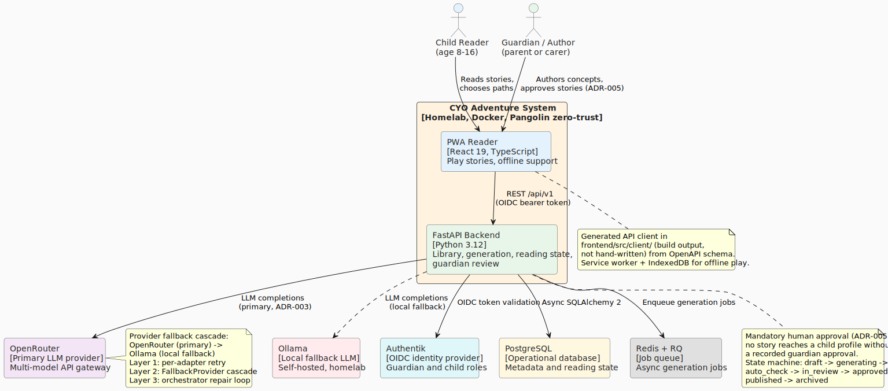
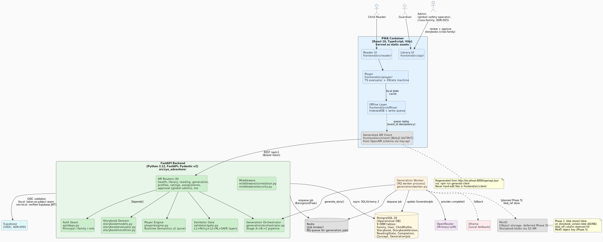

CYO Adventure is a choose-your-own-adventure reading app for kids. A React 19 PWA
lets children read and play through branching stories offline; a FastAPI backend
serves the story library, manages reading progress, and runs an LLM-powered story
generation pipeline behind a mandatory admin approval gate (ADR-005).

## C4 Level 1: System Context

The system context shows the three human actors and the external systems the CYO
Adventure system depends on.



**Key relationships:**

- **Child Reader** uses the PWA to read stories, make choices, and progress through
  branching narratives, including while offline.
- **Guardian/Author** uses the PWA to submit story concepts and monitor generation
  jobs for the family; a guardian cannot self-approve.
- **Admin (Approver)** is a global, cross-family role (`is_admin`) that reviews and
  approves stories before any child can see them (ADR-005: mandatory approval).
  Guardians and children who attempt the approve action receive 403.
- **OpenRouter** is the primary LLM provider, tried across two legs: leg 1 (primary
  model, claude-haiku-4.5) then leg 2 (fallback model, claude-sonnet-4.6). Stories are
  generated through a three-stage pipeline (Structure, Prose, Repair) with a provider
  fallback cascade.
- **Ollama** is the local fallback LLM (leg 3). If both OpenRouter legs fail
  (leg-fatal errors), the `FallbackProvider` cascade tries Ollama before giving up.
- **Supabase Auth** provides OIDC identity (ADR-009). The guardian identity and child
  session are encoded in the token; the local dev environment uses a token-as-subject
  seam, while non-local environments verify the JWT via `jwt.PyJWKClient` (see `api/deps.py`).
- **PostgreSQL** holds all operational metadata: family records, users, child profiles,
  storybook lifecycle, reading state, completions, generation jobs.

## C4 Level 2: Containers

The container diagram shows how the system is split across runtime boundaries.



**Container responsibilities:**

| Container | Technology | Responsibility |
|-----------|------------|----------------|
| PWA | React 19, TypeScript, Vite | Reader UI, library, offline cache, XState player |
| FastAPI Backend | Python 3.12, FastAPI, Pydantic v2 | API routers, auth, validator, generation dispatch |
| Generation Worker | RQ, Python | Async staged generation; long-running, separate container |
| PostgreSQL | PostgreSQL 16, SQLAlchemy 2 | All operational entities (22 ORM tables) |
| Redis | Redis 7, RQ | Generation job queue and broker |
| MinIO | MinIO / S3 API | Story blob storage (deferred to Phase 5; Phase 1 uses inline JSONB) |
| Cloudflare R2 | R2 / S3 API | AI cover-art (WebP) object storage, ADR-017 (shipped); written by the covers RQ worker (`covers/worker.py`) |

**The OpenAPI contract:**

The PWA never hand-writes HTTP request or response types. The frontend
`src/client/` directory is fully generated from the backend's OpenAPI schema:

```bash
# Start the backend, then:
cd frontend && npm run generate-client
```

Treat `frontend/src/client/` as build output; do not edit files there directly.

## Lifecycle State Machines

No story reaches a child profile without a recorded admin approval (ADR-005).
Two independent lifecycles enforce this, with no bypass path.

**GenerationJob** tracks one staged-generation attempt:

```text
queued -> running -> passed | needs_review | failed
```

**Storybook** tracks the review-and-publish lifecycle of a story
(`publishing/state_machine.py`):

```text
draft ----submit-----> in_review ----approve----> published --archive--> archived
  |                        |
  |auto_reject             |send_back
  v                        v
needs_revision <-----------+
  |
  +--submit--> in_review
```

The `in_review -> published` (approve) transition requires a **global admin**
(`is_admin`), which is cross-family; a guardian or child who attempts it receives
403. Automated checks (validation gate plus moderation) drive `draft -> in_review`
or `draft -> needs_revision`; a reviewer can send a story back with
`in_review -> needs_revision`. There is no `generating`, `auto_check`, or `approved`
storybook state; those live only in the GenerationJob lifecycle (`passed`,
`needs_review`) or are folded into `published`. A story is visible to a child only
in `published`.

## Further Reading

- [Generation Pipeline](generation-pipeline.md): staged LLM generation and provider cascade
- [Validation and Player](validation-and-player.md): validator gate and story engine
- [Data Model](data-model.md): the 22 ORM tables and their relationships
- [Deployment](deployment.md): homelab Docker deployment
- ADR-005: [Mandatory Human Approval](../planning/adr/adr-005-mandatory-human-approval.md)
- ADR-002: [Client: Progressive Web App](../planning/adr/adr-002-client-pwa.md)
