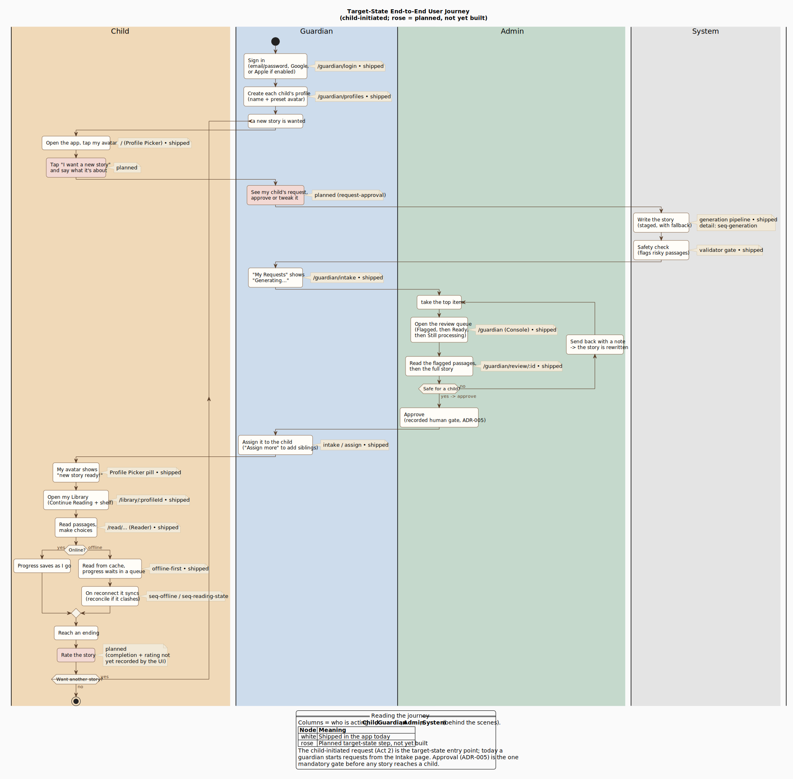
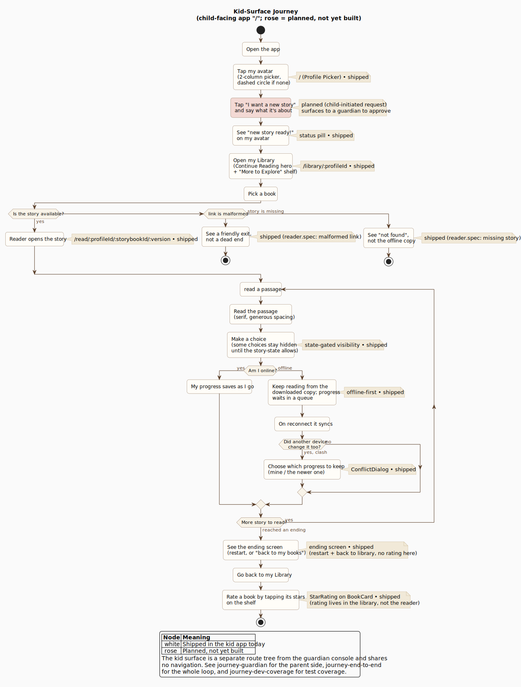
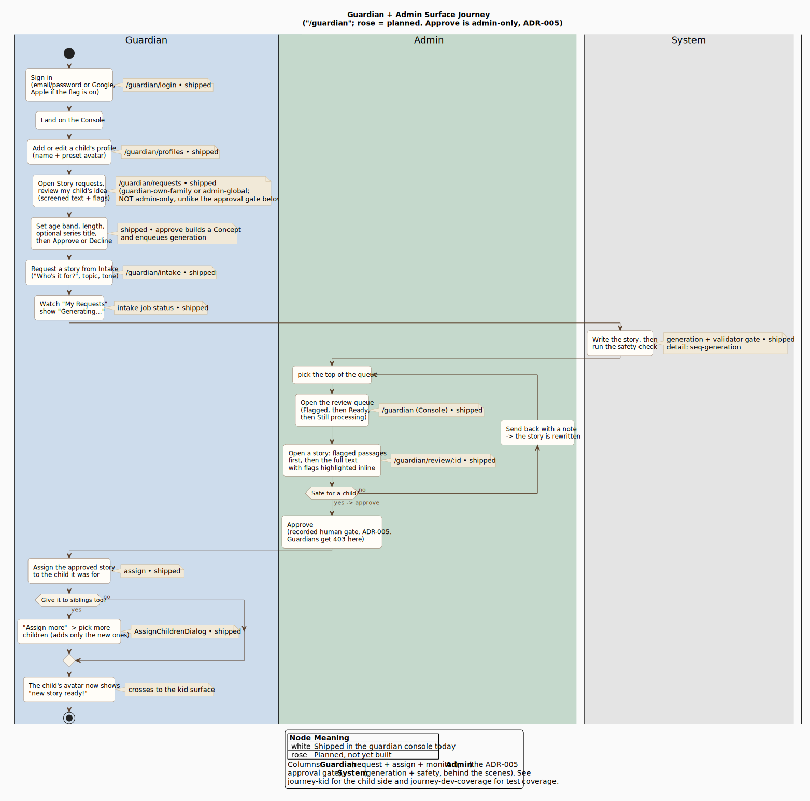
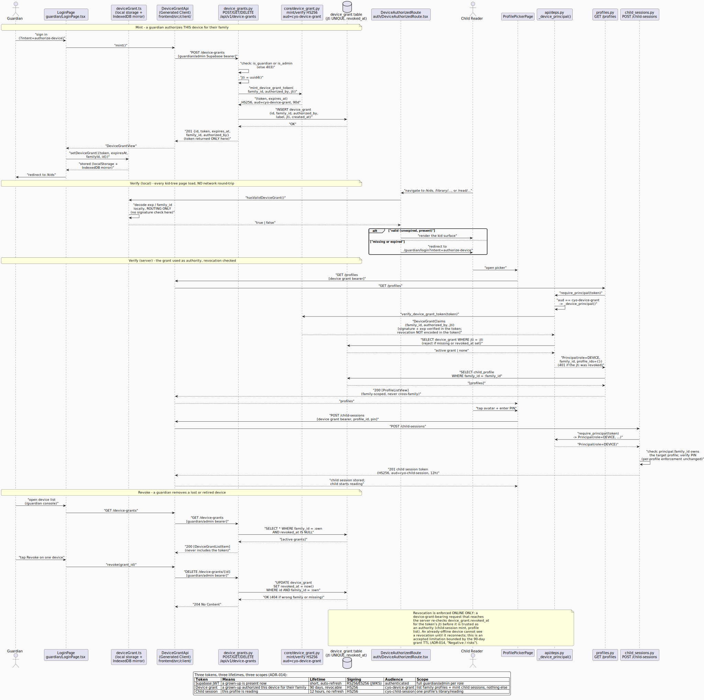
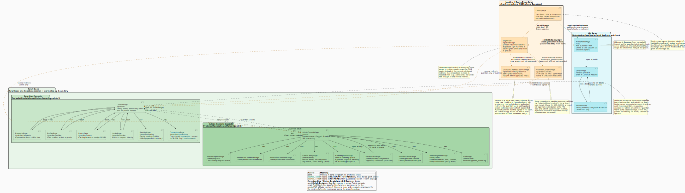
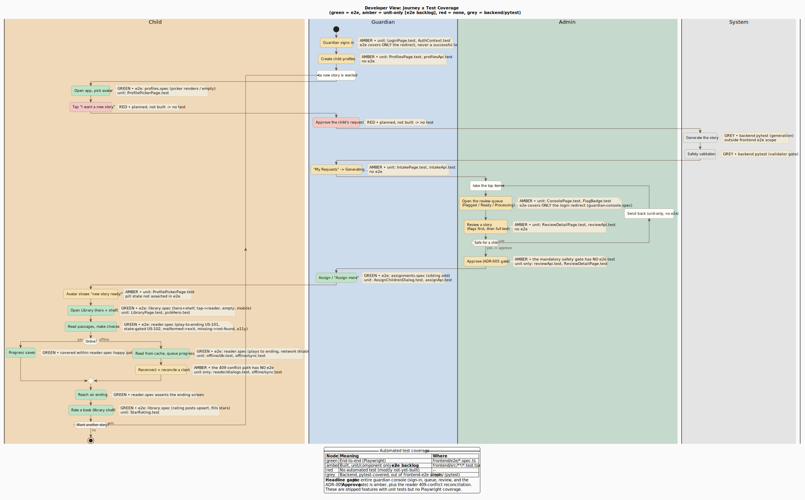

The other architecture diagrams describe how the system is built: containers,
components, data model, and API sequences. This page describes what a *person*
does, screen by screen, to get value from the app. It is a product/UX-clarity
view, not an API sequence, so the boxes are user actions and user-facing waits
rather than endpoints and database locks.

This page holds a set of journey diagrams that work together:

| Diagram | Use it for |
| ------- | ---------- |
| [End-to-end journey](#target-state-end-to-end-journey) | The whole loop across all roles; onboarding a new contributor to the product |
| [Kid-surface journey](#zoomed-journeys-per-surface) | Detailed child-facing flow; frontend work on the reader, library, and picker |
| [Guardian + admin journey](#zoomed-journeys-per-surface) | Detailed parent-facing flow; request, approval gate, and assignment work |
| [Device-grant sequence](#device-authorization-adr-014) | Mint/verify/revoke mechanics behind the device grant; auth/security work |
| [Sitemap and flows](#site-map-and-flows-adr-014) | Every route, its purpose, and the two auth-boundary crossings; navigation/routing work |
| [Developer test-coverage view](#developer-view-test-coverage) | Evaluating e2e/Playwright sufficiency; finding test gaps |

The three journey diagrams (end-to-end, kid, guardian) use the same swimlane
convention and the same shipped/planned color language, so they read as one
family. The device-grant sequence and sitemap are a different diagram shape
(sequence, and nested-package component) covering the same ADR-014 material at
a more mechanical altitude.

## Target-state end-to-end journey

### How to read it

- **Columns are who is acting.** The journey deliberately crosses four lanes:
  the **Child** and **Guardian** each drive their own disjoint surface (the kid
  app and the guardian console share no navigation; see
  `frontend/src/router.tsx`), the **Admin** holds the mandatory
  approval gate, and **System** collapses the behind-the-scenes generation and
  safety work into user-facing waits.
- **Node fill marks maturity.** White nodes are shipped in the app today; rose
  is the key for a planned, not-yet-built step. Every step in the current
  end-to-end loop is shipped, so the diagram carries no rose nodes now; the key
  is retained for future additions.
- **Primary path is child-initiated.** A child asks for a story from their
  library and a guardian (or an admin) approves the request; this path is
  shipped (WS-B). A guardian can also start a request directly from the Intake
  page. See Act 2.

## The journey, act by act

Each act below names the real screen or route it maps to and whether it is
shipped or planned.

### Act 1: Guardian onboarding (once)

A guardian signs in at `/guardian/login` (email/password or Google today; Apple
sign-in is gated behind a config flag) and creates a profile for each child at
`/guardian/profiles`. Profiles use preset illustrated avatars only, never
uploaded photos. This act runs once and sits outside the repeating story loop.

**Device authorization (ADR-014).** Sign-in is now conditional, not a step every
visit demands. The landing page (`/`) is device-state-aware: on a device that
already carries a valid, non-expired device grant, the Kids door goes straight to
`/kids` and the child never sees a guardian login at all. Only a cold entry (a
brand-new device) or an already-revoked/expired grant routes the Kids door
through `/guardian/login?intent=authorize-device`, where a guardian signing in
mints a 90-day, revocable, family-scoped device grant for that device and is then
dropped back to the kid picker. From then on that device needs no further
guardian sign-in for a child to read, online or offline. Post-login, a guardian
lands on `/guardian`, an admin-only adult on `/admin`, and a dual-role adult on
`/guardian` (with a one-hop link into `/admin`).

**The single kid-to-adult boundary (ADR-014).** The two former per-page
"Grown-ups only" gates collapsed into one `AdultGate` at the root of the whole
adult subtree, wrapping both `/guardian` and `/admin`. A signed-in adult
navigating guardian&#8596;guardian, guardian&#8596;admin, or admin&#8596;guardian
never sees the password re-entry once warm (warm state lives in
`sessionStorage`, 5-minute TTL); the challenge fires only when crossing UP into
the adult subtree from kid mode, or on a cold session. See
[seq-device-grant](diagrams/seq-device-grant.svg) for the mint/verify/revoke
mechanics and [sitemap-and-flows](diagrams/sitemap-and-flows.svg) for the full
route map and the two boundary crossings (`DeviceAuthorizedRoute`, `AdultGate`).

### Act 2: Requesting a story

**Child-initiated (primary path, shipped):** a child opens the kid app, picks
their avatar (`/kids`), opens their Library (`/library/:profileId`), taps
"Request a story," and says what it is about. That request surfaces to a
guardian (or an admin), who approves or declines it at `/guardian/requests`
(guardian-own-family) or `/admin/requests` (admin, cross-family). Approval
builds a `Concept` and enqueues generation (WS-B).

**Guardian-initiated (also shipped):** a guardian can instead author a request
directly from the Intake page (`/guardian/intake`) with "Who's it for?" first,
then a topic and tone, then "Request Story." Both entry points are live.

### Act 3: Behind the scenes

The system writes the story through a staged pipeline with a provider fallback
cascade, then runs a deterministic safety check that flags risky passages. To
the guardian this is just a "Generating..." status in their "My Requests" list.
For the engineering detail behind this lane, see the
[generation sequence](diagrams/seq-generation.svg) and the
[generation pipeline](generation-pipeline.md) page.

### Act 4: The approval gate (ADR-005)

This is the single mandatory checkpoint before any story reaches a child. In the
Admin Console (`/admin`, the parallel adult surface for the admin capability),
the review queue is ordered Flagged, then Ready to review, then Still
processing. Opening a story (`/admin/review/:storybookId`) surfaces its flagged
passages first, then the full text. The reviewer either **approves** or **sends it
back** with a note; a sent-back story is rewritten and re-enters the queue (the
inner loop in the diagram).

The approve action is the recorded human gate required by
[ADR-005](../planning/adr/adr-005-mandatory-human-approval.md) and requires the
admin capability: a plain guardian cannot self-approve (the API returns 403).
One adult may hold both roles (guardian plus the `is_admin` capability) and
switches between `/guardian` and `/admin` via the shell nav. The diagram places
the whole review-and-approve sequence in the Admin lane to keep that gate
visually unambiguous.

Beyond this approval gate, the admin console also holds cross-family and
operational surfaces this journey does not draw: the master library
(`/admin/library`: every storybook in any status, cross-family, #277), user
management (`/admin/users`: guardians/admins, child profiles, families, and
directional family connections; WS-J #267), the authoring queue
(`/admin/authoring-queue`), the moderation dashboard and thresholds, the
provider allowlist (`/admin/provider-allowlist`), and the audit log
(`/admin/audit`). See [sitemap-and-flows](diagrams/sitemap-and-flows.svg) for
the full admin map.

Newer family-facing surfaces (ADR-015/016/017, #270) that the acts above do not
yet trace: a guardian notification bell and a `/guardian/reading` visibility
page, cross-family connection consent (`/guardian/connections`), recommendation
chips on the kid library, kid passage flagging in the reader (which files a
`kid_flag` for admin review), and a prose-only passage editor on the admin
review surface that re-runs the validation gate and moderation on every edit.

### Act 5: Assignment

An approved story is assigned to the child it was written for; "Assign more"
widens it to siblings without re-requesting. On the kid surface, the child's
avatar on the Profile Picker flips to a "new story ready!" status pill.

### Act 6: Reading and rating

The child opens their Library (`/library/:profileId`), which leads with a
"Continue Reading" hero card and a shelf grid, then opens the Reader
(`/read/:profileId/:storybookId/:version`). They read passages and make
branching choices until they reach an ending. Reading is offline-first: if the
device is offline, the child reads from cache and progress waits in a queue,
syncing on reconnect and reconciling if it clashes (see
[offline and reconnect](diagrams/seq-offline.svg) and
[reading-state sync](diagrams/seq-reading-state.svg) for the mechanics). The
ending screen itself offers only restart and "back to my books"; **rating lives
on the library shelf**, where tapping a `BookCard`'s stars upserts the rating.
Rating is shipped, not planned (an earlier draft of this page had it wrong).

### Loop

Wanting another story returns to the top of the loop (Act 2). Guardian
onboarding in Act 1 is not repeated.

## Shipped vs planned at a glance

| Journey step | Screen / route | Status |
| ------------ | -------------- | ------ |
| Guardian sign-in | `/guardian/login` | Shipped |
| Create child profiles | `/guardian/profiles` | Shipped |
| Child requests a story | Library (`/library/:profileId`) | Shipped |
| Guardian/admin approves the child's request | `/guardian/requests`, `/admin/requests` | Shipped |
| Generation + safety validation | generation pipeline | Shipped |
| Guardian-initiated request | `/guardian/intake` | Shipped |
| Admin review + approve/send-back | `/admin`, `/admin/review/:id` | Shipped |
| Assign / assign more | Intake / assign | Shipped |
| "New story ready!" pill | Profile Picker (`/`) | Shipped |
| Library and Reader | `/library/...`, `/read/...` | Shipped |
| Offline read + reconnect sync | Reader | Shipped |
| Rate a book | Library shelf (`BookCard`) | Shipped |

## Zoomed journeys (per surface)

The end-to-end diagram spans every role at one altitude. When working on a
single surface, the zoomed diagrams carry more screen-level detail (error exits,
the offline branch, the assignment sub-flow) without the cross-role noise.

### Kid surface

The child-facing route tree (`/kids`, behind the landing page's Kids door). It
adds detail the master view omits: the device-authorization branch at entry
(ADR-014: an authorized device skips guardian login entirely; an unauthorized
one routes through `/guardian/login?intent=authorize-device` once, then never
again), the three-way "is the story available?" branch (a malformed link shows
a friendly exit, a missing story shows not-found rather than the offline copy),
the read-loop with its online/offline and 409-conflict branches, and rating as
a library-shelf action reached after the ending returns the child to their
books.

### Guardian and admin surface

The parent-facing console (`/guardian` and `/admin`, both behind a single
`AdultGate` at the root of the adult subtree, ADR-014). It details the
request-and-approval pipeline: sign-in (now conditional: a cold session or a
step-up crossing UP from kid mode, never adult-to-adult navigation),
role-based landing (admin-only to `/admin`, guardian-only or dual-role to
`/guardian`), profile management, the Intake request with its "Generating..."
status, the review queue ordered Flagged then Ready then processing, the
approve/send-back revision loop, and the assign / "Assign more" sub-flow.
Approve is the admin-only ADR-005 gate.

### Device authorization (ADR-014)

The mechanical sequence behind the journey-level device-authorization notes
above: minting a device grant (`POST /v1/device-grants`), the local (no
network round-trip) client-side check `DeviceAuthorizedRoute` performs on
every kid-surface page load, the backend verification and revocation check
that runs when the grant is actually used to mint a child session or list
profiles, and revocation (`DELETE /v1/device-grants/{id}`). See
[ADR-014](../planning/adr/adr-014-device-authorized-kid-access.md) for the
full three-token model.

### Site map and flows (ADR-014)

Every route in the app, its purpose, and how the pages link to each other,
drawn as a nested-package component diagram (the same shape as
[component-api-persistence](diagrams/component-api-persistence.svg)) rather
than a swimlane journey. Three zones: the device-state-aware landing (`/`,
`/guardian/login`), the Kid zone (`/kids`, `/library/:profileId`,
`/read/:profileId/:storybookId/:version`, gated by `DeviceAuthorizedRoute`),
and the Adult zone (`/guardian/*` with `/admin/*` nested inside it, gated by
the single `AdultGate`). Solid arrows are ordinary in-zone navigation;
distinctly styled dashed arrows and notes mark the two auth-boundary
crossings (`DeviceAuthorizedRoute` at the landing-to-kid edge, `AdultGate` at
the landing-to-adult edge and on the kid-to-adult step-up). Read it
left-to-right within a zone and top-to-bottom across zones; the boundary
arrows are the only edges that cost a credential check.

## Developer view: test coverage

This is the same end-to-end backbone recolored by automated test coverage, so
the journey doubles as a Playwright/e2e gap map. It is the diagram to consult
when deciding what e2e tests to write next.

> **Interim (updated 2026-07-17):** this diagram derives its backbone from
> `journey-end-to-end.puml`. Its coverage coloring is accurate for the
> request -> approve -> read loop it shows, but the backbone has not been
> re-drawn to add the ADR-014 device-grant / AdultGate steps or the WS-J admin
> surfaces (user management #267, authoring queue #268, moderation
> dashboard/thresholds, provider allowlist). Those surfaces now have their own
> e2e specs (see the diagram's coverage-sources note); refresh the backbone
> alongside the next e2e coverage pass rather than as part of this update.

- **Green** steps are exercised end-to-end by a Playwright spec under
  `frontend/e2e/`.
- **Amber** steps are built but only unit/component-tested (`frontend/src/**/*.test.tsx`).
  Amber is the **e2e backlog**: shipped behavior with no browser-level test.
- **Red** steps have no automated test at all; here they line up with the
  not-yet-built steps.
- **Grey** steps are backend work covered by pytest, out of frontend-e2e scope.

### What the coverage view surfaces

- The **kid surface is well covered end-to-end**: reader (play-to-ending,
  offline read, state-gated choices, malformed/missing error states, tap-target
  and no-scroll a11y), library (hero, shelf, rating, empty, mobile), and sibling
  assignment all have Playwright specs.
- The **guardian console is now e2e-covered too**: sign-in, profile management,
  intake, the review queue, review detail, the send-back revision loop, and the
  **ADR-005 Approve gate** all have Playwright specs alongside their existing
  Vitest coverage. Approve carries two layers: a mocked e2e test
  (`guardian-review.spec.ts`, including the guardian-403 fail-closed case) and a
  real-backend smoke test (`e2e-real/approval-flow.spec.ts`) that exercises the
  gate with zero mocks against a real FastAPI and Postgres stack. Run it with
  `npm run test:e2e:real` (runbook: `frontend/README.md`).
- The reader **409-conflict reconciliation** path, once amber, now has a
  dedicated spec covering both reconciliation outcomes.
- The offline-queue **reconnect flush** is implemented and tested:
  `replayQueue()` is invoked by `hooks/useReplayOnReconnect.ts` (mounted in
  `reader/ReaderRoute.tsx`) on reconnect, with unit coverage in
  `useReplayOnReconnect.test.ts` and the reconciliation path in
  `e2e/reader-conflict.spec.ts`. This supersedes an earlier note that called it
  unimplemented (issue #110).

| Former e2e gap | Covered by |
| -------------- | ---------- |
| Guardian successful sign-in | `frontend/e2e/guardian-auth.spec.ts` |
| Console review queue + ordering | `frontend/e2e/guardian-console.spec.ts` |
| Review detail + **Approve (ADR-005)** | `frontend/e2e/guardian-review.spec.ts` (+ `e2e-real/approval-flow.spec.ts`) |
| Send-back / revision loop | `frontend/e2e/guardian-review.spec.ts` |
| Intake request + job status | `frontend/e2e/intake.spec.ts` |
| Guardian profile management | `frontend/e2e/guardian-profiles.spec.ts` |
| Reader 409-conflict reconciliation | `frontend/e2e/reader-conflict.spec.ts` |

## Related pages

- [System Overview](system-overview.md): the same three actors as C4 boxes
  rather than journey lanes.
- [Validation and Player](validation-and-player.md): the reader engine and
  offline sync that Act 6 rides on.
- [Generation Pipeline](generation-pipeline.md): the System lane of Act 3 in
  full.
- [ADR-014: Device-authorized kid access](../planning/adr/adr-014-device-authorized-kid-access.md):
  the decision behind the device grant and the single AdultGate boundary.
- [Data Model: `device_grant`](data-model.md#device_grant): the table backing
  the device grant.
- [Authorization Matrix: Device principal](../planning/authorization-matrix.md#device-principal-adr-014):
  the endpoint-level allowlist and IDOR test for the device token.
