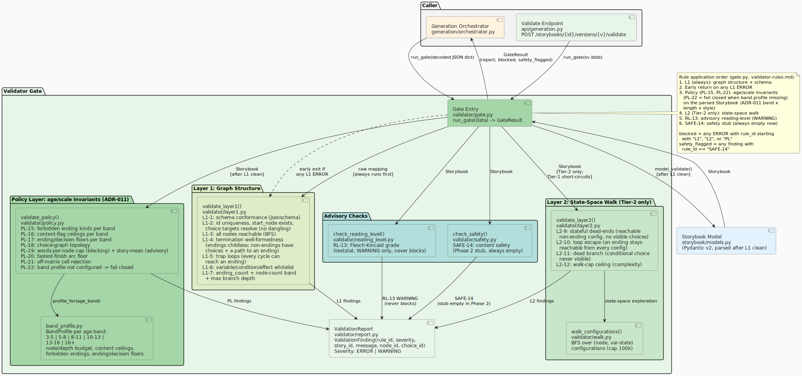
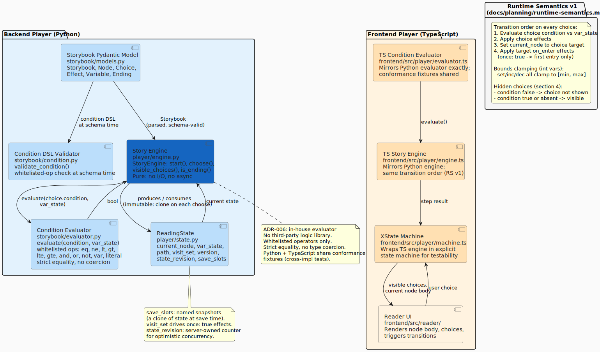
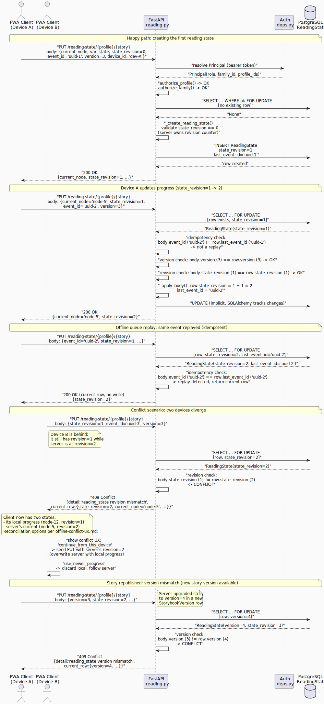
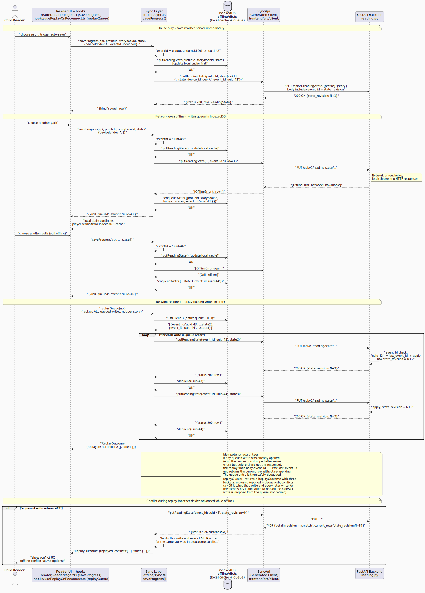

## Validator Gate

The validator gate (`validator/gate.py`) is the single entry point that the
generation orchestrator and the `/validate` API endpoint call to verify a
decoded Storybook JSON document. It orchestrates four layers in a fixed order.

### Rule Application Order

From `docs/planning/validator-rules.md`:

1. **Layer 1 (L1-1..L1-7): graph structure and schema** (always runs first)
2. **Early exit on any L1 ERROR**: the graph must be structurally sound before a
   state-space walk is meaningful; an L1 error means the document may not even parse.
3. **Layer 2 (L2-9..L2-12): state-space walk** (Tier-2 stories only; Tier-1 short-circuits)
4. **RL-13: advisory reading-level check** (WARNING severity, never blocks)
5. **SAFE-14: safety content check** (Phase 2 stub, always empty)

### Blocking Semantics

`blocked` is `True` when any `ERROR`-severity finding whose `rule_id` starts with
`"L1"` or `"L2"` is present in the merged report. RL-13 findings are `WARNING` and
never block. SAFE-14 findings route to human review via `safety_flagged`, not `blocked`.

### Layer 1 Rules

| Rule | What it checks |
|------|----------------|
| L1-1 | Schema conformance (jsonschema against exported Pydantic schema) |
| L1-2 | `start_node` exists in the node list |
| L1-3 | All nodes are reachable from `start_node` (networkx) |
| L1-4 | At least one ending node exists |
| L1-5 | No choice targets a non-existent node (no dangling edges) |
| L1-6 | Variable usage is consistent (inc/dec on declared int vars only) |
| L1-7 | Story depth budget not exceeded |

### Layer 2 Rules

Run only for Tier-2 (state-tracking) stories after L1 passes:

| Rule | What it checks |
|------|----------------|
| L2-9 | Every reachable path eventually reaches an ending |
| L2-10..L2-12 | Reachability properties under variable conditions (BFS over state space) |

## Story Player Engine

The player engine (`player/engine.py`) implements **Runtime Semantics v1**
(`docs/planning/runtime-semantics.md`). It is pure: no I/O, no async, no shared
mutable state. The TypeScript player (`frontend/src/player/engine.ts`) and
the Layer-2 validator walk reproduce its behavior exactly; cross-implementation
conformance fixtures prove it.

### Transition Order (per runtime-semantics.md section 1)

On every choice selection:

1. Evaluate the choice condition against the current `var_state`.
2. Apply the choice effects.
3. Set `current_node` to the choice target.
4. Apply the target node's `on_enter` effects (`once: true` first-entry only).

### Key Semantics

**Hidden choices (section 4):** A choice whose condition evaluates to `false` is
hidden from `visible_choices()`. It is not shown to the reader and cannot be selected.

**Bounds clamping (section 3):** `inc`, `dec`, and `set` on `int` variables all clamp
to the variable's declared `[min, max]` range. This prevents a story from seeding an
out-of-range value that conditions later compare against.

**`once: true` effects:** An `on_enter` effect marked `once: true` runs only on the
first entry to a node. The `visit_set` in `ReadingState` tracks which nodes have been
visited. The validator (Layer 2) uses the same walk to verify these semantics hold.

**Immutability:** `choose()` returns a fresh `ReadingState`; the input state is not
mutated. This makes saves, save-slot snapshots, and test replays reliable.

## Condition Evaluator

The condition evaluator (`storybook/evaluator.py`) implements the whitelisted-operator
subset of a JSONLogic-shaped condition DSL (ADR-006: in-house evaluator, no third-party
logic library).

**Whitelisted operators:** `eq`, `ne`, `lt`, `gt`, `lte`, `gte`, `and`, `or`, `not`,
`var`, and literal values.

**Strict equality, no coercion:** `eq` uses `==` without type coercion. A `bool`
variable is never equal to an `int` under the evaluator.

The TypeScript evaluator (`frontend/src/player/evaluator.ts`) mirrors this behavior.
Shared conformance fixtures run against both implementations to detect divergence.

## Reading-State Sync

### Revision-Based Optimistic Concurrency

`PUT /reading-state/{profile}/{story}` saves progress using `state_revision` for
optimistic concurrency control:

- The server owns the revision counter; the first save must start at `state_revision=0`.
- The PUT body carries the `state_revision` value the client started from.
- If the stored revision differs, the server returns 409 with the current row so the
  client can reconcile.
- A `SELECT ... FOR UPDATE` row lock serializes concurrent saves for the same profile
  and story.

### Idempotent Offline Queue Replay

Each save carries an `event_id` (UUID). If the server sees an incoming `event_id` that
matches `last_event_id` on the stored row, it returns the current row without re-applying
the write. This makes offline queue replay safe: a write that was applied before a
network dropout can be replayed without double-applying its effects.

### Offline Play and Reconnect

When the network is unavailable, writes are queued in IndexedDB (`offline/db.ts`).
On reconnect, `replayQueue()` replays them in order against the server. If any write
yields a 409, the client presents a conflict resolution UI per `docs/design/offline-conflict-ux.md`.

## Key Source Files

| File | Purpose |
|------|---------|
| `src/cyo_adventure/validator/gate.py` | `run_gate()`, `GateResult` |
| `src/cyo_adventure/validator/layer1.py` | L1-1..L1-7 graph rules (networkx) |
| `src/cyo_adventure/validator/layer2.py` | L2-9..L2-12 state-space walk |
| `src/cyo_adventure/validator/reading_level.py` | RL-13 advisory check (textstat) |
| `src/cyo_adventure/validator/safety.py` | SAFE-14 stub (Phase 2) |
| `src/cyo_adventure/validator/walk.py` | BFS/DFS state-space walker |
| `src/cyo_adventure/validator/report.py` | `ValidationReport`, `ValidationFinding`, `Severity` |
| `src/cyo_adventure/player/engine.py` | `StoryEngine` (Runtime Semantics v1) |
| `src/cyo_adventure/player/state.py` | `ReadingState` dataclass |
| `src/cyo_adventure/storybook/models.py` | `Storybook`, `Node`, `Choice`, `Effect` |
| `src/cyo_adventure/storybook/evaluator.py` | `evaluate()`, whitelisted condition ops |
| `src/cyo_adventure/storybook/condition.py` | Condition DSL validator |
| `src/cyo_adventure/api/reading.py` | Reading-state and completions endpoints |
| `frontend/src/player/engine.ts` | TypeScript mirror of engine.py |
| `frontend/src/player/evaluator.ts` | TypeScript mirror of evaluator.py |
| `frontend/src/player/machine.ts` | XState machine wrapping the TS engine |
| `frontend/src/offline/sync.ts` | `saveProgress()`, `replayQueue()`, `OfflineError` |
| `frontend/src/offline/db.ts` | IndexedDB: local cache and write queue |

## Related ADRs

- ADR-001: [Story Format: JSON Storybook](../planning/adr/adr-001-story-format-json-storybook.md)
- ADR-006: [Conditions: In-House Evaluator](../planning/adr/adr-006-conditions-inhouse-evaluator.md)
- ADR-002: [Client: Progressive Web App](../planning/adr/adr-002-client-pwa.md)
