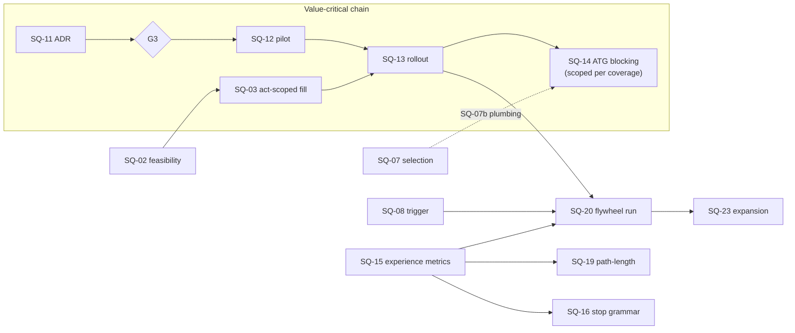

# Story Structure and Diversity Improvement Plan

> **For the implementation team**: per-deliverable implementation briefs, with file/function anchors,
> current behavior, change specifications, test plans, and the onboarding reading list, are in
> [story-structure-implementation-briefs.md](story-structure-implementation-briefs.md). Read the
> briefs' section 0 before writing any code.

## 0. Objective and non-goals

**Objective**: a reader's next story should feel like a new adventure, and the system should be able
to tell when it will not. Concretely: raise experience-level distinctness between any two stories a
reader encounters (not graph-level metric distance), on the paths readers actually use.

**Non-goals**, restated from the analysis so they cannot creep back in:

- No relaxation of the safety gate or the determinism architecture. Every deliverable operates inside
  the ADR-011 constraint grammar.
- No bulk catalog growth ahead of the demand sensor and distinctness measures (analysis section 7).
- No sampling-temperature lever (trades against RL-13; the variation axes are the instrument).
- No new diversity metric may become a target without a falsification path (WS-0 method rule: measure
  first, no targets asserted in advance of calibration data).
- **Deliberately unchanged rails, recorded so their absence from the deliverables is a decision and
  not an oversight**: PL-20 (min-complete floors) and PL-21 (the offered-cell matrix) are load-bearing
  safety and scale rails; the envelope-convergence remedy is variance *within* the rails (SQ-19's
  PL-17 reshape, SQ-21's outcome economies, SQ-16's grammar measurement), not loosening them. PL-19
  word budgets stay as-is pending SQ-16's stop-based measurement. The topology checker's three-class
  collapse (analysis 2.3) gets no checker change: the selection-relevant signal is deliberately moved
  to SQ-15's experience metrics instead of expanding a label vocabulary nothing verifies.

**Method rules inherited from plan v2**: every claim of "delivered" carries a Ref; a deliverable that
changes a supervisor-ruled contract says so; effort is S (hours to a day), M (days), L (a week plus or
a program).

## 1. Shape of the plan: critical path and parallel lanes

Five stages ordered by the loop analysis (analysis section 5): the deployed system first, then the
signals, then the ceiling, then the measures, then growth.

### 1.1 Critical path

The plan's core outcome (experience-distinct stories on repeated trees, enforced) runs through the
beat-variant program, and the ATG blocking flip is **scoped, not global**: the guard flips to
blocking per skeleton as that skeleton's variant slice lands, and globally only once the rollout
covers the production cells. So the value-critical chain is:

**SQ-11 (ADR) -> G3 (accept) -> SQ-12 (pilot, falsification gate) -> SQ-13 (per-skeleton rollout) ->
SQ-14 (ATG blocking, scoped per SQ-13 coverage, gate G4)**, with **SQ-03 (act-scoped fill)** joining
as a prerequisite for SQ-13's large-tree slices. SQ-12 alone never justifies a global flip; that
would leave the un-varianted majority of the catalog under a blocking guard with frozen beats, which
is exactly the constraint-conflict failure item 1 of section 1.3 forbids.

Two chains, named precisely so the diagram, the prose, and the briefs' `Depends:` lines agree:

- **Value-critical chain** (what delivers the objective): SQ-11 -> G3 -> SQ-12 -> SQ-13 -> SQ-14.
- **Longest dependency chain** (what determines the schedule's tail): SQ-02 -> SQ-03 -> SQ-13 ->
  SQ-20 -> SQ-23. This is why SQ-02 starts in week one and SQ-03 immediately after it, even though
  growth itself is deliberately last.

Start SQ-11 and SQ-02 immediately after PR review; SQ-03 follows SQ-02 within the first week.

### 1.2 Parallel lanes (suggested team split)

Five lanes (A through E in the table below: four engineering-leaning, plus Lane E for growth and
content, which is authoring- and ops-heavy) run concurrently without stepping on each other's
files; the owner reviews everything (section 7). Items within a lane are ordered; lanes are
independent except where the critical path says otherwise.

| Lane | Items in order | Skills | Notes |
| --- | --- | --- | --- |
| **A: Pipeline** (critical-path support) | SQ-05, SQ-02, SQ-03, SQ-04, SQ-06 | Backend, prompts | SQ-05 first (cheapest real gain); SQ-03 is the long pole |
| **B: Signals and selection** | SQ-07, SQ-08, SQ-10 items 1-2, SQ-09(a) | Backend, simulation | All independent of Lane A; SQ-07(b) plumbing is a prerequisite for SQ-14 later; SQ-10 item 3 is delivered with SQ-15 |
| **C: Beat variants** (value-critical chain) | SQ-11, SQ-12, SQ-13, SQ-14 | Design + authoring + backend | SQ-11 starts day one; SQ-12 starts only after G3 accepts the ADR; SQ-13 consumes Lane A's SQ-03 for large trees |
| **D: Measurement and reader** | SQ-15, SQ-16, SQ-18, SQ-17, SQ-19 | Backend + frontend | SQ-18 is the natural frontend-heavy item; SQ-15 feeds Lanes B and E |
| **E: Growth and content** | SQ-01 (runbook, week one), SQ-09(b), SQ-21, SQ-20, then SQ-22/SQ-23 decisions | Authoring + ops | SQ-01 is the single highest-impact week-one item in the whole plan; SQ-09(b)/SQ-21 are authoring-heavy and pair together |
| Cross-cutting | SQ-24 | Docs | Any time; closes UW-C25/UW-G17 |

Minimum viable staffing: two engineers (Lanes A+C and B+D merged) plus the owner on gates, review,
and the authoring-heavy slices. With three engineers, split as tabled. SQ-01 is lane-independent and
should happen in week one regardless of staffing.

### 1.3 Hard sequencing constraints

From the review (violating these re-creates the loop):

1. **SQ-14 (ATG blocking) is scoped to variant coverage: per skeleton after that skeleton's SQ-13
   slice, global only after the rollout covers production cells, and never before SQ-12 proves
   variants work.** Blocking a guard over frozen beats creates an unsatisfiable constraint set
   (directive says differentiate, contract says depict the same scene) and yields retry loops;
   scoping is what makes the flip incremental instead of a cliff.
2. **SQ-17 (D11 replacement) requires the two-compliant-trees floor** or each cell transitions
   through a scheduled pool-of-1 trough at the 4-merges/month promotion rate.
3. **SQ-20/SQ-23 (growth) after SQ-08 (trigger respec) and SQ-15 (experience metrics)**, so growth is
   aimed by a sensor that works and judged by a measure that correlates with experience.
4. **Every catalog-growth merge adds its slotting-plus-variant obligation to the Stage 2 schedule at
   promotion time** (capacity rule, section 7). No silent debt.

## 2. Stage 0: close the deployment gap

The analysis's largest correction: as deployed, a child can reach zero catalog books and the
automated fill cannot render a large, method-dependent fraction of the skeletons (16-29 of 58 under
plausible token estimates; SQ-02's calibrated estimator settles the exact set). Until this stage
lands, catalog-diversity work is idle machinery.

| ID | Deliverable | Evidence / register | Effort | Acceptance |
| --- | --- | --- | --- | --- |
| SQ-01 | **Promote the inventory.** Issue #347 records an import run of the 23 authored books to `in_review` on 2026-07-21; `generation/import_catalog.py` imports but by design never publishes (its own docstring says so), so the actual gap is promotion, not import. First runbook step: verify current `visibility` state per book (neither this plan nor its author can query the live database, so this is a check, not an assumption). Then drive the still-`in_review` books through the re-moderation sweep (#529/#537) and per-story `publishing/catalog_publish.py::promote_catalog_story`. Owner gate G1 decides the publish list and order. | Analysis 2.6; UW-G14; catalog-first-inventory-gap.md; issue #347 | S (process) + review time | A kid profile's library lists catalog books in every offered band that has approved content; `visibility='catalog'` rows exist; UW-G14 closed with Ref |
| SQ-02 | **Fill-feasibility predicate in selection.** Estimate per-skeleton token demand (sum of `words=` targets plus JSON overhead, calibrated against the 26 committed fills); exclude infeasible candidates from automated-path selection with a logged reason; a cell whose feasible pool is empty 422s with a distinct reason code instead of burning the repair budget. | Analysis 2.6, 5; AL-046; UW-C07 | S-M | No automated job targets an infeasible skeleton (test); the doomed-request path is a fast 422; feasible-pool size is logged per request |
| SQ-03 | **Act-scoped fill loop.** Chunk the fill by act/subtree with a stable shared context, per AL-046's proposal; each chunk re-states the differentiation directive and variation axis (which also makes SQ-05's repair threading uniform). Landing SQ-03 also flips SQ-02's selector input from the whole-story cap to the per-chunk cap, so previously infeasible skeletons re-enter selection; the estimator survives for chunk sizing and logging. | Analysis 2.6, 2.7; AL-046 | M-L | The largest production skeleton fills end to end on the automated path; per-chunk fidelity checks pass; one committed fill of a previously infeasible skeleton; an end-to-end test from candidate selection (previously infeasible skeleton now selectable) through successful act-scoped fill |
| SQ-04 | **Skill-path parity.** `.claude/skills/cyo-author/` reads the persisted differentiation level, prior-title context, and variation axis; `generation/import_story.py` records them; the skill's compliance report shows which axis was applied. | Analysis 2.7; no register row (new) | S-M | A skill-authored fill's report names its axis; grep shows import_story consuming the metadata; parity test comparing worker and skill prompt contexts |
| SQ-05 | **Wiring fixes (two small, high-leverage).** (a) `select_axis`: pass the family's recent axis keys as `exclude=`, seed per job id so re-runs vary; (b) thread the variation axis and differentiation directive into all three repair prompts (structural, fidelity, moderation soft-gate). | Analysis 2.7, 5; no register row (new) | S | Re-run of a rejected fill draws a different axis (test); repair prompt fixtures contain the directive block; axis-repeat rate on consecutive family requests drops below 1/15 baseline |
| SQ-06 | **Cover-art style variation.** Parameterize the fixed style clause in `covers/prompt.py` by band and tone (teen gamebooks stop getting "warm, whimsical" covers). | Analysis 2.7 | S | At least 3 distinct style clauses exercised across bands; safety clause behavior unchanged (test) |

## 3. Stage 1: signals and selection correctness

Make the family-scoped, slug-keyed machinery see readers and structures. All items are independent of
Stage 0 and can interleave.

| ID | Deliverable | Evidence / register | Effort | Acceptance |
| --- | --- | --- | --- | --- |
| SQ-07 | **Selection rebalance.** (a) Cap the W2.2 theme-overlap attraction bonus (owner gate G2 picks the cap; default proposal 1.3x) so it cannot dominate a 3-tree cell cross-family; (b) add per-profile history scoping with family fallback; (c) count distinct storybooks, not version rows, in the recency window; (d) de-weight candidates by `structural_distance` and valence-histogram proximity to the reader's recent trees. The `1/(1+x)` novelty floor is preserved throughout (decision C-4). | Analysis 4 items 2-3, 5; plan v2 deferred row (per-profile) | M | Monte Carlo over the shipped selector: cross-family first-request concentration on a themed tree drops from ~1/2 toward ~1/3; per-profile repeat rate measured and reported; all existing selection tests pass |
| SQ-08 | **Flywheel trigger respec.** Count distinct *families*, not request ids. Contract: the `CELL_SATURATED` payload stays closed-enum-only (it carries no family field today); family scope reaches the trigger via a request-to-family join at read time on the event's `entity_id` (the request id), per the implementation brief. Also: treat an empty/unknown theme signature as conservative (counts toward saturation) rather than dissimilar; verify LEAF/CATALOG are reachable for out-of-vocabulary themes in a multi-child window simulation. | Analysis 5 (dark sensor); flywheel/trigger.py | S-M | End-to-end test from saturation emission through distinct-family counting (two requests from one family collapse to one); an unusual-theme family reaches CATALOG within N similar requests (simulation); a single prolific family alone cannot trigger (test); trigger docstring updated |
| SQ-09 | **Clone labeling and resolution.** (a) Add within-run WL-hash isomorphism to `diversity/incell.py` (proof labeling; never compare against stored hashes, networkx v3.5 changed them); (b) execute A9 item 2: restructure `the-sunken-temple` past `TAU_CELL` (the 35-ending remix design in the register), emptying the allowlist. | Analysis 2.4, 4 item 5; UW-G03 | S (a) + L (b) | Audit output labels the pair ISOMORPHIC until fixed; after (b), allowlist empty and the audit passes clean; SR-9 still passes on the brass-lantern chain |
| SQ-10 | **Metrics honesty.** Items 1-2 (Stage 1): a per-theme-cohort concentration report (which (tree, theme) pairs dominate across families) and dashboard annotations for ECS and net-new-trees stating their known failure modes. Item 3 is explicitly a Stage 3 follow-on delivered with SQ-15 (the flywheel headline metric gains a perceived-distinctness condition); SQ-10 closes at Stage 1 on items 1-2. | Analysis 5 (metrics reward the failure mode) | S-M | The WS-0 report shows cohort concentration; dashboard docstrings state what each metric cannot see |

## 4. Stage 2: lift the armature ceiling (the decisive bet)

The frozen beat armature is the mechanism of "themes swapped in" (analysis 2.5), and beat variants
are the only lever that changes the scene a reader gets on a repeated tree. This phase is a program,
not a task, and it carries the plan's largest authoring cost; the capacity model in section 7 governs
its schedule.

| ID | Deliverable | Evidence / register | Effort | Acceptance |
| --- | --- | --- | --- | --- |
| SQ-11 | **Alternate-beats design doc and ADR.** Outcome contract per node (same successor state, same choice semantics, same ending kind/valence); 2-3 authored variants per node; per-fill variant-set selection (deterministic, seeded per job); the issued variant becomes the fidelity target; variants change no graph edge, so L1/L2 costs are zero by construction. Two review-mandated requirements: variants are authored under deliberately varied model/prompt/exemplar settings (anti-monoculture), and the ADR includes the capacity model. Owner gate G3 accepts the ADR. | Analysis 2.5, 5, 6.2; UW-G12 (unblocks it) | M (doc) | ADR accepted; schema change for variant storage reviewed against `storybook/models.py` and `slotted_surfaces.py`; fidelity gate design names the issued variant as its target |
| SQ-12 | **Pilot on the two slotted MVP skeletons** (`the-lost-mitten`, `the-clocktower-cipher`, already A20-complete). Author 2-3 variants per node; generate paired fills (same tree, same theme, different variant vs same variant); measure masked unigram/bigram distance and RL-13. Falsifiable: the experiment defines success as a measured, pre-registered margin on ATG distance with no RL-13 regression; if variants do not move the distance, the program stops and the plan reverts to catalog growth as the primary lever. | Analysis 6.2; WS-0 method | M | Paired-fill report committed under research/ or evidence/; margin met or program decision recorded either way |
| SQ-13 | **Variants rollout across all 58 production-eligible skeletons, per skeleton.** The backlog covers the whole production catalog, because the objective is distinctness between any two stories a reader encounters: the **13 unslotted production skeletons** get a combined slotting-plus-variants pass (the 14th no-contract file is the MVP seed `the-sunken-signal`, excluded with the other test-tier scaffolds), and the **45 already-contracted production skeletons** get a variants-only pass (the other 2 contracts belong to the delivered MVP pilots). Each pass also backfills subject-axis values into the skeleton's existing `metadata.themes` list, closing the 9-of-22 subject-tag gap. Priority order: most-requested cells first (from request history once SQ-01 ships serving data), small trees before the 300-node teens. Each skeleton is its own schedulable slice with its own Ref. | UW-G01; analysis 6.2 items 6 and 11 | L (program) | Per-skeleton: contract passes `scripts/check_theme_contract.py`, variants pass the SQ-11 gate, structural fingerprint unchanged; rollout tracker table appended to this plan |
| SQ-14 | **ATG contract revision, calibration, and SCOPED blocking.** After SQ-12 proves variants: revise the supervisor-ruled fail-open contract in `moderation/leaf_diversity.py` (this is a ruling change and says so), calibrate `_BAND_THRESHOLDS` from pilot panel data, compare against the k most recent same-tree fills (k=3) scoped per profile with family fallback. Blocking is per skeleton, gated on that skeleton's SQ-13 variant slice having landed (a skeleton with frozen beats stays advisory); global blocking is declared only when SQ-13 covers the production cells. Owner gate G4 makes the ruling. | Analysis 4 item 1, 5; UW-G04 | M | Thresholds committed with their derivation; a deliberately templated fill on a varianted skeleton FAILs and blocks in test; a fill on an un-varianted skeleton stays advisory (test); fail-open paths enumerated and each justified or closed |

## 5. Stage 3: measure the experience

| ID | Deliverable | Evidence / register | Effort | Acceptance |
| --- | --- | --- | --- | --- |
| SQ-15 | **Per-path experience metrics** in `structure_features`: decision cadence over rendered stops (post-ADR-026 the stop, not the node, is the experience unit), corridor ratio, outcome-mix entropy over sampled walks, median-walk depth, agency density (share of decision stops whose options reach different ending valences; single definition, shared with the implementation brief and the metric tests). Wire into SQ-07's de-weighting and the flywheel ranking key. | Analysis 6.3; plan v2 walker (validated, 0 divergences / 1,800 walks) | M | Metrics computed for all 61 skeletons and committed as a baseline; selection and ranking consume at least two of them; unit tests pin the walker lockstep property |
| SQ-16 | **Stop-based ADR-011 section 10 compliance measurement.** Implement the real stop-level rule as a *report* first (UW-C23: nothing computes stop adjacency in the validator today), measure the catalog, and only then decide gating. Never re-use the node-level D1 figure (AL-076's unit lesson). | UW-C23, UW-C24; analysis 3 | M | Compliance table per skeleton committed; gating decision recorded with the measurement attached |
| SQ-17 | **D11 amendment: replacement floor.** A grandfathered skeleton leaves selection for a cell only when at least 2 grammar-compliant trees exist there. One-paragraph amendment to the design-review decision plus a selection-filter test. | Analysis 5 (pool-of-1 trough) | S | Amendment recorded; simulation shows no cell's feasible pool drops below 2 during transition |
| SQ-18 | **A13b ending-screen affordance + engagement rollup.** (a) Deliver "Try a different way" (ADR-024-authorized, 3-hop walk to the last real pick, fallback one step). (b) *Conditional*: add a skeleton-level rollup to engagement telemetry so per-stop signals aggregate across fills of a tree. `node_engagement` does not exist in `src/` or `supabase/migrations/`; it is proposed in reader-path-engagement-design.md (`status: proposed`), so (b) cannot start until that design is ratified and shipped, which no deliverable here schedules. | Plan v2 A13b; analysis 3, 5 (telemetry blind to the armature) | M ((a) alone: S-M) | (a) A13b behind the existing reader flag with its designed availability rule, tested. (b) if and only if the telemetry ships: rollup query joins `storybook_version.skeleton_slug`, tested |
| SQ-19 | **Path-length honesty.** AL-027's median-uniform-walk advisory per cell; UW-M06's PL-17 gamebook floor reshape so the endings floor stops rewarding terminating-leaf breadth. | AL-027; UW-M06 | M | Advisory emits for the known worst offenders; floor reshape lands as a validator change with a catalog impact report (no whole-class failure, per AL-051) |

## 6. Stage 4: grow the structure space (demand-driven, last)

| ID | Deliverable | Evidence / register | Effort | Acceptance |
| --- | --- | --- | --- | --- |
| SQ-20 | **One manually targeted flywheel run, end to end.** Pick one Tier-1 cell (AL-049 rules out state-heavy gamebook parents until the operator termination fix); run T1/T3 chains; take one mutant through reguide, gate, human PR, and merge. Purpose: retire integration risk and produce the first non-hand-authored tree; judged by SQ-15 metrics, not only TAU_CELL. | Analysis 2.4, 6.4; ADR-020; AL-049 | M-L | One merged promotion PR with lineage record `origin: mutation`; SQ-15 distinctness report attached; AL-049 fix or explicit Tier-1 scoping recorded |
| SQ-21 | **Outcome-economy spread per gamebook cell.** Author deliberate win/fail-mix variation across each gamebook cell's trees (e.g. 2-win gauntlet, 5-6-win graded-setback tree, capture-dominant survival shape), keyed on the fail-kind mix (the one variable that keys satisfying-path mass, eta-squared 0.636). Pairs naturally with SQ-09(b)'s remix. | Analysis 2.2, 6.4 | M-L | Per-cell outcome-mix variance is nonzero (measured); PL-15/16/24 pass; gamification's endings gallery no longer renders a wall of identical death cards in the pilot cell |
| SQ-22 | **Pathfinder Phase 0 go/no-go.** Owner gate G5, with the legal review hard gate as specified. If go: one pilot skeleton in a 13-16 gamebook cell per the exploration doc's phased path. | pathfinder-structure-exploration.md; analysis 6.4 | Decision + L if go | Decision recorded in the exploration doc; if go, pilot passes the unchanged gate |
| SQ-23 | **Demand-driven cell expansion.** Wave-5-style authoring only for cells the respecified sensor (SQ-08) actually flags, judged by SQ-15, scheduled under the capacity rule. Explicitly not started before SQ-08 and SQ-15. | Analysis 7; UW-G13 | L (per cell) | Each expansion cites its triggering saturation evidence |

**Cross-cutting: SQ-24, the ADR-011 amendment** (UW-G17 + UW-C25): adopt the verified JHM citation
(Adams, Beckelhymer and Marr 2019, DOI 10.5642/jhummath.201902.05), mark decisions-per-playthrough as
derived, label words/node and total-words as designer priors, record the Ashwell
eight-pattern-to-six-topology mapping, and resolve the five reconciliation actions including
reconvergence targets. Effort S-M; unblocked now that [research/](research/README.md) exists.

## 7. Capacity model (implementation team + owner as gate)

The plan assumes an implementation team executes the briefs while the owner remains the human
approval gate that ADR-005 and the flywheel's S7 rule require: the owner reviews every PR, adjudicates
every gate G1-G6, and personally approves any content that could reach a child (published books,
restructured series books, promoted mutants, authored variants). The binding constraint therefore
shifts from authoring hours to **owner review bandwidth**, and the rules below protect it:

- **The team never merges content-bearing changes without the owner**: skeleton edits, beat variants,
  ending remixes, and publish promotions are owner-reviewed by name, not by rubber stamp. Pure-code
  changes (selection weights, metrics, wiring) follow normal PR review.
- **Two concurrent content programs maximum** (SQ-13 rollout plus one of SQ-09(b)/SQ-21). Code lanes
  A/B/D are not capped.
- **Per-skeleton Stage 2 cost is measured, not assumed**: the pilot (SQ-12) records hours for an
  11-node and a 25-node skeleton; the 100-250-node prose skeletons are estimated from that measurement
  before scheduling; the 300-680-node teen books are scheduled last and only with the act-scoped fill
  (SQ-03) landed.
- **Growth pays its own debt**: any merged promotion (SQ-20/SQ-23) or new skeleton immediately appends
  its slotting-plus-variant slice to the SQ-13 backlog table. A tree with unpaid debt is not counted
  as catalog growth in any report (extends SQ-10).
- **Variant anti-monoculture costs extra by design**: SQ-11's model/prompt-variation policy means
  variant authoring cannot be one batch run; the schedule reflects at least two distinct authoring
  configurations per skeleton.
- **The volume is stated, not implied.** Full SQ-13 coverage at 1-2 additional variants per node over
  the ~11,400 production FILL nodes is on the order of 11,000-23,000 authored variant beats, every
  one owner-reviewed. That number is why the rollout is serving-priority-ordered, why ending nodes
  and climaxes come first within each skeleton (highest perceived-repeat load per authored beat), and
  why this plan deliberately asserts **no calendar durations or end dates**: the pilot (SQ-12)
  measures per-node cost first, and dates are derived from that measurement, not asserted ahead of
  it. Partial coverage is a legitimate steady state; the scoped SQ-14 flip means every completed
  skeleton delivers its value immediately.

## 8. Owner decision gates

| Gate | Decision | Blocks | Default proposal |
| --- | --- | --- | --- |
| G1 | Publish list and order for the 23 authored books already imported to `in_review` per issue #347 | SQ-01 | Promote all books that pass the #529 re-moderation sweep, kid bands first. Stated cost, accepted consciously: this ships the single-voice, no-diversity-machinery inventory as-is (analysis 2.7), on the judgment that a reachable catalog beats an empty one; the SQ-13 variant passes are the remedy, and G1 may hold back specific look-alike pairs. Re-authoring the inventory through the parity-fixed path (SQ-04) first is the alternative, at much higher cost |
| G2 | Theme-overlap bonus cap value | SQ-07(a) | 1.3x as an initial engineering BOUND, not a calibrated value (the no-uncalibrated-targets rule applies to success metrics; this is a safety cap on a known concentrator). SQ-10's cohort-concentration report calibrates it after one month of serving |
| G3 | Alternate-beats ADR acceptance (the ADR is SQ-11's deliverable; G3 follows it) | SQ-12, SQ-13, SQ-14 | Accept with the pilot as the falsification gate |
| G3b | Pilot-falsification exit (fires only if SQ-12 misses its pre-registered margin) | SQ-13, SQ-14 vs the pivot | Owner decides on the SQ-12 run record: stop the variant program, promote SQ-15 into Stage 2's slot, and re-center on Stage 4 growth judged by experience metrics |
| G4 | ATG contract ruling (fail-open advisory to scoped blocking) | SQ-14 flip | Per-skeleton blocking gated on SQ-13 coverage, one bounded repair as remediation; global only when rollout covers production cells |
| G5 | Pathfinder Phase 0 go/no-go (+ legal review; owner of both: repository owner; legal review completes before any Phase 0 work starts) | SQ-22 | Defer to the Stage 4 boundary. Note: teen engagement data would inform this, but no scheduled deliverable produces it (reading telemetry is deferred behind the privacy review), so absent data the decision is product judgment, stated as such |
| G6 | ADR-011 amendment scope (SQ-24) | SQ-24 | Full scope per UW-G17 plus UW-C25 |
| G7 | Phase disposition for the whole SQ program: map Stage 0-4 (and SQ-01 specifically) onto the register's closed phase vocabulary, per section 11.1 | Whether the register/manifest treat any SQ item as gating R1 (full)/M5.1, and whether UW-G12's `post-launch`/`blocked` cell still holds once SQ-11 unblocks it | Adopt section 11.1's proposed mapping: SQ-01 to `R1`/`M5.1` as a usability gap, not `content`; SQ-16 and SQ-18 keep their already-established `4b`; every other SQ item to `content`, matching the roadmap's Content workstream, which is explicitly release-rung-independent. The ruling should also resolve UW-G12's now-inconsistent `post-launch`/`blocked` cell against Stage 2's value-critical-chain priority; that register edit is out of this plan's file scope |

## 9. Success measures

Split by what can be measured now vs what needs serving history. Precision about the word
"falsifiable": exactly one measure carries a pre-registered pass/fail threshold today (SQ-12's
paired-fill margin), because it is the only one with a controlled experiment behind it. Every other
measure is a *baselined direction*: the first measurement sets the baseline, the stated direction is
the claim, and thresholds are added only after calibration data exists (WS-0 method rule). A measure
moving the wrong way against its baseline is the falsification event for these.

**Pre-launch, grouped by the deliverable that makes each measurable** (SQ-01 is not the exit
criterion for the later-phase measures; each group becomes available when its named deliverable
lands):

- Available immediately or with SQ-01: catalog reachability, count of published catalog books per
  band (baseline 0).
- Available with SQ-02: feasible-pool coverage, share of offered cells whose automated-path feasible
  pool is >= 2 (baseline today unknown, measured first).
- Available with SQ-05: axis behavior, axis-repeat rate on consecutive same-family requests and
  re-run axis variation.
- Available with SQ-07: selection concentration, Monte Carlo cross-family first-request probability
  of the themed tree in a 3-tree cell (baseline ~1/2, direction: toward 1/3).
- Available with SQ-11 + SQ-12: paired-fill distance, masked unigram/bigram distance between
  same-tree fills with different beat variants vs same variant (the pilot's pre-registered margin).

**Post-launch (need real families):**

- Per-profile repeat-adventure rate over per-profile windows (not the family-window version).
- Per-theme-cohort concentration across families (SQ-10).
- Saturation events originating from multi-child and out-of-vocabulary-theme families (today
  structurally zero; any nonzero count proves the sensor respec).
- Skeleton-level stop-abandonment rollup: whether "everyone stops at the same corridor" is now
  attributable to shared beats (SQ-18).

## 10. Risks

- **Capacity is the binding constraint.** Stage 2 is an authoring-heavy program whose content
  approvals all route through the single owner-reviewer; the mitigation is the
  section 7 rules and the per-skeleton measurement before scheduling, not optimism.
- **Variant monoculture**: variants authored by one model in one batch would inherit the correlation
  they exist to break; SQ-11's policy is the mitigation and SQ-12's paired measurement is the check.
- **Blocking-gate whiplash**: flipping the ATG early recreates the retry-loop failure; the G4 gate is
  explicitly sequenced behind the pilot.
- **Privacy**: per-profile scoping (SQ-07, SQ-14) uses child-linked reading history internally; it
  adds no new external surface, but the children's-privacy ADR owner should confirm the internal-use
  classification before SQ-07(b) lands.
- **Gamification collision**: endings-gallery mechanics ship into today's negative-ending monoculture;
  SQ-21's pilot cell should precede or accompany the gamification rollout in teen gamebook cells.
- **Pilot falsification**: if SQ-12 shows variants do not move perceived distance, the plan's center
  of gravity moves to Stage 4 (more trees) with SQ-15 as the distinctness judge; that outcome is a
  legitimate exit, recorded, not a failure of the plan.

## 11. Relationship to existing planning, and the SQ-to-register map

**Supersession, stated per the repo convention.** This plan takes over the *scheduling* function for
the still-open diversity work; [story-diversity-plan-v2.md](story-diversity-plan-v2.md) remains
`active` as the record of the delivered A/B deliverables and their evidence, and carries a pointer
banner to this plan for its open items.
[story-diversity-implementation-plan.md](story-diversity-implementation-plan.md), whose only function
was sequencing plan v2, is marked `superseded` for scheduling in this PR, with one carve-out stated
in its banner: its section 4 rule-ID reservations against open PR #416 remain binding, because this
plan does not restate them. The measurement records
([story-diversity-analysis.md](story-diversity-analysis.md) and its errata) are not superseded; the
new [analysis](story-structure-diversity-critical-analysis.md) extends them and says so in its
section 8. This plan does not modify register rows; each flips with a Ref when its deliverable lands,
and if an SQ item is ever dropped from this schedule while still worth doing, it must be registered
as a UW row before removal.

**Complete SQ-to-register map.** The `SQ-*` namespace is registered in
[`plan-manifest.toml`](plan-manifest.toml)'s `[namespaces.sq]` table, so `scripts/check_work_linkage.py`
validates every id below against that pattern and checks the table for duplicates the same way it
validates the other four id namespaces. It also cross-checks this table against the five per-stage
deliverables tables in both directions, so an item defined with no scheduling record, or a map entry
naming no defined item, is reported rather than accepted. The "Register / source" column stays
freeform prose, not machine-checked; this table is still the audit surface for where each `SQ-*`
item's scheduling record lives, and a change to it is a change to the only linkage record that exists
for this namespace.

| SQ | Register / source | SQ | Register / source |
| --- | --- | --- | --- |
| SQ-01 | UW-G14 | SQ-13 | UW-G01 (+ UW-G12 variants half) |
| SQ-02 | UW-C07 (AL-046 half) | SQ-14 | UW-G04 |
| SQ-03 | UW-C07 (AL-046 half) | SQ-15 | new (analysis 6.3 item 12) |
| SQ-04 | new (analysis 2.7) | SQ-16 | UW-C23, UW-C24 |
| SQ-05 | new (analysis 2.7, 5) | SQ-17 | new (analysis 5, D11 amendment) |
| SQ-06 | new (analysis 2.7) | SQ-18 | plan-v2 A13b + A18 (unregistered rows) |
| SQ-07 | plan-v2 deferred (per-profile) | SQ-19 | UW-M06 + AL-027 (open) |
| SQ-08 | new (analysis 5, dark sensor) | SQ-20 | UW-G09 adjacent; AL-049 (open) |
| SQ-09 | UW-G03 (b); new (a) | SQ-21 | new (analysis 6.4 item 16) |
| SQ-10 | new (analysis 5, metrics) | SQ-22 | pathfinder doc Phase 0 (decision) |
| SQ-11 | UW-G12 (unblocks it) | SQ-23 | UW-G13 |
| SQ-12 | UW-G12 (pilot half) | SQ-24 | UW-G17, UW-C25 |

"new" means the item originates in the reviewed analysis rather than a register row; it is scheduled
work from inception, which is why no UW row is minted for it. The rebuilt research base
([research/README.md](research/README.md)) grounds SQ-24 and the constants this plan treats as
designer priors. Terminology note: this plan's internal Stage 0-4 grouping is deliberately not called
"Phase" to avoid colliding with the register's closed phase vocabulary, whose source of truth is
`roadmap.md`.

### 11.1 Proposed phase home for the SQ program (owner decision, gate G7)

**The problem, stated plainly.** Stage 0-4 is a schedule, not a phase: the previous paragraph's
terminology note explains why it avoids the word "Phase", but the consequence is that the register's
closed phase vocabulary (product phases, milestones, release rungs, `content`, `post-launch`, and the
other sentinels; see `unscheduled-work-register.md`'s "Phase vocabulary" and "Non-phase dispositions"
tables) cannot express where this program lands relative to the R1/R2/R3 rungs. Nothing in this plan
answers "does SQ-13 ship before or after R1 (full)/M5.1 sign-off", because that question can only be
answered in the register's vocabulary and this plan deliberately does not write to the register
(section 11's opening paragraph). This subsection proposes an answer; it does not assert one, because
assigning a `Phase` cell is an owner decision under this repo's conventions (the register's "Not
allowed" list forbids anything but a real phase token or `blocked`/`decision` with a named blocker,
and the vocabulary's own "Source of truth" column names `roadmap.md`, not this plan). Gate G7 in
section 8 is where the owner rules on the mapping below; nothing here edits a register row or the
manifest.

**Proposed mapping, reasoned from the actual work, not asserted by fiat:**

| Stage / SQ items | Proposed token | Reasoning | Owner call? |
| --- | --- | --- | --- |
| Stage 0: SQ-02, SQ-03 | `content` | Already the register's own disposition for the underlying item (UW-C07, `content`/unscheduled); this plan changes nothing about that classification. | No, follows precedent |
| Stage 0: SQ-04, SQ-05, SQ-06 | `content` | Unregistered ("new"), but they are Lane A prerequisites for the same fill-pipeline work as SQ-02/SQ-03 and ship no user-visible surface on their own; grouping them with their lane is the low-friction default. | Mild: no register row to anchor the token, so this is inference by lane, not citation |
| Stage 0: **SQ-01** | `R1` (full) / `M5.1`, not `content` | Distinctive case, argued explicitly. UW-G14 currently carries `content`, and the roadmap's Content workstream states outright that this workstream "does not block a release rung" (roadmap.md's Content workstream section, Dependencies). But `M5.1`'s own definition is "every family-tier register row at delivered status" with the five golden journeys green, and a library with zero reachable catalog books is not a family-tier row at delivered status: it is the core reading loop failing for any family that has not yet completed a custom request. Promotion (the corrected SQ-01 mechanism, see the Stage 0 table above) is a day-scale operational step gated on a moderation sweep, not an authoring program; treating it as ordinary `content` cadence buries a usability gap inside a bucket the roadmap has defined as non-blocking. Default proposal: `R1` (full) / `M5.1`. | **Yes, explicit owner call**: this reverses UW-G14's current `content` cell and the roadmap's own framing; the owner may instead affirm `content` if the empty-catalog gap is judged acceptable pending organic demand |
| Stage 1: SQ-07, SQ-08, SQ-09, SQ-10 | `content` | These are signals/selection code, not authoring, but every adjacent registered item in the same UW-G cluster (e.g. UW-G03, UW-G04) already carries `content`, and the roadmap's Content workstream description covers "diversity and catalog growth" broadly enough to include the selection machinery that serves it. | Mild: stretches the token from authoring to backend-algorithm work; flagged so the owner can reject the stretch if `content` is meant to mean prose authoring specifically |
| Stage 2: SQ-11, SQ-12, SQ-13, SQ-14 | `content` | **The most consequential call in this table.** UW-G12 (SQ-11's target row) is currently `post-launch`/`blocked`, but section 1.1 schedules SQ-11 to start "immediately after PR review" alongside SQ-02 and calls this chain the plan's value-critical chain, not deferred work. Leaving UW-G12 at `post-launch` while this plan treats Stage 2 as the decisive near-term bet is an active contradiction, not a stale label like the SQ-01 case. Proposed resolution: once SQ-11 unblocks UW-G12 (as the section 11 map already notes), its disposition should flip from `post-launch`/`blocked` to `content`, matching the rest of the diversity workstream and its "does not block a release rung" framing (section 7's own admission that this plan asserts no calendar dates supports the same conclusion: decisive in impact, not gating in timing). `content` is proposed over an `R2` release-rung token because nothing in the plan makes Stage 2 a precondition for the iOS shell. | **Yes, explicit owner call**: the owner must reconcile UW-G12's cell with this plan's priority; that register edit is out of this plan's file scope and is listed as a needed change in the authoring report, not made here |
| Stage 3: SQ-15, SQ-17 | `content` | Unregistered measurement work in the same catalog-quality vein as Stage 1's signals items. | Mild, same stretch as Stage 1 |
| Stage 3: SQ-16 | `4b` (unchanged) | Already established: UW-C23 and UW-C24 both carry `4b` today, and choice-grammar enforcement is Editor+UX-phase validator work by the register's own classification. This plan makes no change here; listed for completeness so the mapping table is not silently missing an SQ id. | No, already resolved upstream |
| Stage 3: SQ-18 | `4b` | User-facing reader-UX feature (A13b ending-screen affordance); the roadmap's own linkage table already routes `UW-I*`/`UW-J*` reader-UX gaps to `4b`, and SQ-18 is the same kind of surface. | Mild: no direct UW row for SQ-18 itself (plan-v2 A13b/A18 are unregistered), so this is inference by category |
| Stage 3: SQ-19 | Stays `decision` (UW-M06) | UW-M06 is itself an owner-decision row; this plan does not resolve it, so no phase token is proposed until the owner rules there. | Already a decision row; no new call needed |
| Stage 4: SQ-20, SQ-21, SQ-23 | `content` | UW-G09-adjacent and UW-G13 already carry `content`; SQ-21 is unregistered but is explicitly paired with SQ-09(b) in Lane E and shares its authoring cadence. | No (SQ-20, SQ-23) / mild (SQ-21) |
| Stage 4: SQ-22 | Stays `decision` (pathfinder Phase 0, gate G5) | Already an owner-decision item with its own gate; no phase token is proposed ahead of that ruling. | Already a decision row; no new call needed |
| Cross-cutting: SQ-24 | Stays `post-launch`/`decision` (UW-G17) | Already established and internally consistent with UW-C25's `doc` disposition; no tension to flag. | No |

**Net answer to the opening question, if the defaults above are accepted:** almost the entire SQ
program (Stage 1, most of Stage 0, all of Stage 2, most of Stage 3 and 4) lands on `content`, which
the roadmap defines as explicitly not gating any release rung; that is a coherent answer, not an
evasion, because it matches how this work has always been scheduled once the register finally gave it
a home (roadmap.md's Content workstream section). The two deliberate exceptions are SQ-01, proposed as
an `R1` (full)/`M5.1` blocking item because it is a reachability gap rather than catalog growth, and
SQ-16/SQ-18, which inherit the already-scheduled `4b` (post-R1 Editor+UX) phase. The single item the
owner most needs to rule on is Stage 2: its current register cell (`post-launch`/`blocked` via UW-G12)
contradicts this plan's own framing of it as the decisive, near-term bet, and that contradiction
predates this plan.
