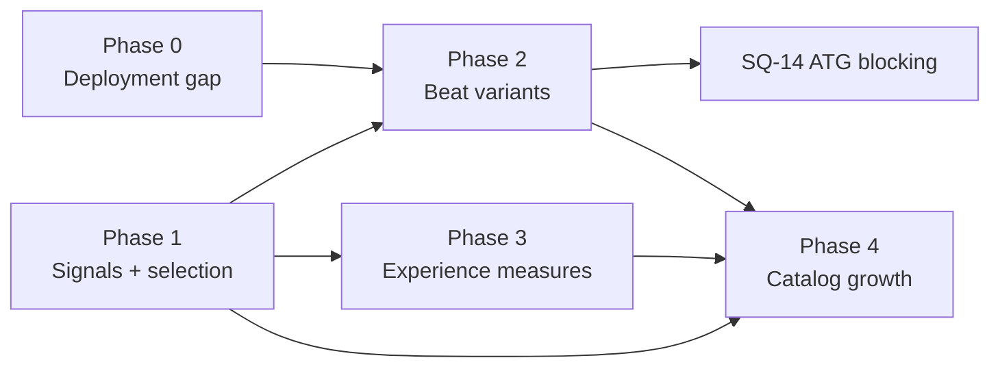

# Story Structure and Diversity Improvement Plan

## 0. Objective and non-goals

**Objective**: a reader's next story should feel like a new adventure, and the system should be able
to tell when it will not. Concretely: raise experience-level distinctness between any two stories a
reader encounters (not graph-level metric distance), on the paths readers actually use.

**Non-goals**, restated from the analysis so they cannot creep back in:

- No relaxation of the safety gate or the determinism architecture. Every deliverable operates inside
  the ADR-011 constraint grammar.
- No bulk catalog growth ahead of the demand sensor and distinctness measures (analysis section 7).
- No sampling-temperature lever (trades against RL-13; the variation axes are the instrument).
- No new diversity metric may become a target without a falsification path (WS-0 method rule: measure
  first, no targets asserted in advance of calibration data).

**Method rules inherited from plan v2**: every claim of "delivered" carries a Ref; a deliverable that
changes a supervisor-ruled contract says so; effort is S (hours to a day), M (days), L (a week plus or
a program).

## 1. Shape of the plan

Five phases ordered by the loop analysis (analysis section 5): the deployed system first, then the
signals, then the ceiling, then the measures, then growth. Phases 0 and 1 are mostly parallel small
items; Phase 2 is the decisive bet; Phase 4 is deliberately last.

Hard sequencing constraints from the review (violating these re-creates the loop):

1. **SQ-14 (ATG blocking) strictly after SQ-12 (beat-variant pilot proves variants work).** Blocking
   the guard while beats are frozen creates an unsatisfiable constraint set (directive says
   differentiate, contract says depict the same scene) and yields retry loops.
2. **SQ-17 (D11 replacement) requires the two-compliant-trees floor** or each cell transitions
   through a scheduled pool-of-1 trough at the 4-merges/month promotion rate.
3. **SQ-20/SQ-23 (growth) after SQ-08 (trigger respec) and SQ-15 (experience metrics)**, so growth is
   aimed by a sensor that works and judged by a measure that correlates with experience.
4. **Every catalog-growth merge adds its slotting-plus-variant obligation to the Phase 2 schedule at
   promotion time** (capacity rule, section 7). No silent debt.

## 2. Phase 0: close the deployment gap

The analysis's largest correction: as deployed, a child can reach zero catalog books and the
automated fill can render only ~20 of 58 skeletons. Until this phase lands, catalog-diversity work is
idle machinery.

| ID | Deliverable | Evidence / register | Effort | Acceptance |
| --- | --- | --- | --- | --- |
| SQ-01 | **Ship the inventory.** Run `generation/import_catalog.py` for the 23 authored books, drive them through the re-moderation sweep (#529/#537) and per-story `publishing/catalog_publish.py`. Owner gate G1 decides the publish list and order. | Analysis 2.6; UW-G14; catalog-first-inventory-gap.md | S (process) + review time | A kid profile's library lists catalog books in every offered band; `visibility='catalog'` rows exist; UW-G14 closed with Ref |
| SQ-02 | **Fill-feasibility predicate in selection.** Estimate per-skeleton token demand (sum of `words=` targets plus JSON overhead, calibrated against the 26 committed fills); exclude infeasible candidates from automated-path selection with a logged reason; a cell whose feasible pool is empty 422s with a distinct reason code instead of burning the repair budget. | Analysis 2.6, 5; AL-046; UW-C07 | S-M | No automated job targets an infeasible skeleton (test); the doomed-request path is a fast 422; feasible-pool size is logged per request |
| SQ-03 | **Act-scoped fill loop.** Chunk the fill by act/subtree with a stable shared context, per AL-046's proposal; each chunk re-states the differentiation directive and variation axis (which also makes SQ-05's repair threading uniform). | Analysis 2.6, 2.7; AL-046 | M-L | The largest production skeleton fills end to end on the automated path; per-chunk fidelity checks pass; one committed fill of a previously infeasible skeleton |
| SQ-04 | **Skill-path parity.** `.claude/skills/cyo-author/` reads the persisted differentiation level, prior-title context, and variation axis; `generation/import_story.py` records them; the skill's compliance report shows which axis was applied. | Analysis 2.7; no register row (new) | S-M | A skill-authored fill's report names its axis; grep shows import_story consuming the metadata; parity test comparing worker and skill prompt contexts |
| SQ-05 | **Wiring fixes (two small, high-leverage).** (a) `select_axis`: pass the family's recent axis keys as `exclude=`, seed per job id so re-runs vary; (b) thread the variation axis and differentiation directive into all three repair prompts (structural, fidelity, moderation soft-gate). | Analysis 2.7, 5; no register row (new) | S | Re-run of a rejected fill draws a different axis (test); repair prompt fixtures contain the directive block; axis-repeat rate on consecutive family requests drops below 1/15 baseline |
| SQ-06 | **Cover-art style variation.** Parameterize the fixed style clause in `covers/prompt.py` by band and tone (teen gamebooks stop getting "warm, whimsical" covers). | Analysis 2.7 | S | At least 3 distinct style clauses exercised across bands; safety clause behavior unchanged (test) |

## 3. Phase 1: signals and selection correctness

Make the family-scoped, slug-keyed machinery see readers and structures. All items are independent of
Phase 0 and can interleave.

| ID | Deliverable | Evidence / register | Effort | Acceptance |
| --- | --- | --- | --- | --- |
| SQ-07 | **Selection rebalance.** (a) Cap the W2.2 theme-overlap attraction bonus (owner gate G2 picks the cap; default proposal 1.3x) so it cannot dominate a 3-tree cell cross-family; (b) add per-profile history scoping with family fallback; (c) count distinct storybooks, not version rows, in the recency window; (d) de-weight candidates by `structural_distance` and valence-histogram proximity to the reader's recent trees. The `1/(1+x)` novelty floor is preserved throughout (decision C-4). | Analysis 4 items 2-3, 5; plan v2 deferred row (per-profile) | M | Monte Carlo over the shipped selector: cross-family first-request concentration on a themed tree drops from ~1/2 toward ~1/3; per-profile repeat rate measured and reported; all existing selection tests pass |
| SQ-08 | **Flywheel trigger respec.** Count distinct *families*, not request ids; treat an empty/unknown theme signature as conservative (counts toward saturation) rather than dissimilar; verify LEAF/CATALOG are reachable for out-of-vocabulary themes in a multi-child window simulation. | Analysis 5 (dark sensor); flywheel/trigger.py | S-M | Simulation: an unusual-theme family reaches CATALOG within N similar requests; a single prolific family alone cannot trigger (test); trigger docstring updated |
| SQ-09 | **Clone labeling and resolution.** (a) Add within-run WL-hash isomorphism to `diversity/incell.py` (proof labeling; never compare against stored hashes, networkx v3.5 changed them); (b) execute A9 item 2: restructure `the-sunken-temple` past `TAU_CELL` (the 35-ending remix design in the register), emptying the allowlist. | Analysis 2.4, 4 item 5; UW-G03 | S (a) + L (b) | Audit output labels the pair ISOMORPHIC until fixed; after (b), allowlist empty and the audit passes clean; SR-9 still passes on the brass-lantern chain |
| SQ-10 | **Metrics honesty.** Add a per-theme-cohort concentration report (which (tree, theme) pairs dominate across families); annotate ECS and net-new-trees dashboards with their known failure modes; flywheel headline metric gains a perceived-distinctness condition once SQ-15 lands. | Analysis 5 (metrics reward the failure mode) | S-M | The WS-0 report shows cohort concentration; dashboard docstrings state what each metric cannot see |

## 4. Phase 2: lift the armature ceiling (the decisive bet)

The frozen beat armature is the mechanism of "themes swapped in" (analysis 2.5), and beat variants
are the only lever that changes the scene a reader gets on a repeated tree. This phase is a program,
not a task, and it carries the plan's largest authoring cost; the capacity model in section 7 governs
its schedule.

| ID | Deliverable | Evidence / register | Effort | Acceptance |
| --- | --- | --- | --- | --- |
| SQ-11 | **Alternate-beats design doc and ADR.** Outcome contract per node (same successor state, same choice semantics, same ending kind/valence); 2-3 authored variants per node; per-fill variant-set selection (deterministic, seeded per job); the issued variant becomes the fidelity target; variants change no graph edge, so L1/L2 costs are zero by construction. Two review-mandated requirements: variants are authored under deliberately varied model/prompt/exemplar settings (anti-monoculture), and the ADR includes the capacity model. Owner gate G3 accepts the ADR. | Analysis 2.5, 5, 6.2; UW-G12 (unblocks it) | M (doc) | ADR accepted; schema change for variant storage reviewed against `storybook/models.py` and `slotted_surfaces.py`; fidelity gate design names the issued variant as its target |
| SQ-12 | **Pilot on the two slotted MVP skeletons** (`the-lost-mitten`, `the-clocktower-cipher`, already A20-complete). Author 2-3 variants per node; generate paired fills (same tree, same theme, different variant vs same variant); measure masked unigram/bigram distance and RL-13. Falsifiable: the experiment defines success as a measured, pre-registered margin on ATG distance with no RL-13 regression; if variants do not move the distance, the program stops and the plan reverts to catalog growth as the primary lever. | Analysis 6.2; WS-0 method | M | Paired-fill report committed under research/ or evidence/; margin met or program decision recorded either way |
| SQ-13 | **Combined A20 + variants rollout, per skeleton.** One pass per skeleton does slotting (A20) and variants (SQ-11) together. Priority order: most-requested cells first (from request history once SQ-01 ships serving data), small trees before the 300-node teens. The 14 unslotted skeletons and 4,305 nodes (UW-G01) are the backlog; each is its own schedulable slice with its own Ref. | UW-G01; analysis 6.2 | L (program) | Per-skeleton: contract passes `scripts/check_theme_contract.py`, variants pass the SQ-11 gate, structural fingerprint unchanged; rollout tracker table appended to this plan |
| SQ-14 | **ATG contract revision, calibration, and blocking.** After SQ-12 proves variants: revise the supervisor-ruled fail-open contract in `moderation/leaf_diversity.py` (this is a ruling change and says so), calibrate `_BAND_THRESHOLDS` from pilot panel data, compare against the k most recent same-tree fills (k=3) scoped per profile with family fallback, then flip to blocking with the one bounded repair as the remediation path. Owner gate G4 makes the ruling. | Analysis 4 item 1, 5; UW-G04 | M | Thresholds committed with their derivation; a deliberately templated fill FAILs and blocks in test; fail-open paths enumerated and each justified or closed |

## 5. Phase 3: measure the experience

| ID | Deliverable | Evidence / register | Effort | Acceptance |
| --- | --- | --- | --- | --- |
| SQ-15 | **Per-path experience metrics** in `structure_features`: decision cadence over rendered stops (post-ADR-026 the stop, not the node, is the experience unit), corridor ratio, outcome-mix entropy over sampled walks, median-walk depth, agency density (share of decisions whose options reach different endings). Wire into SQ-07's de-weighting and the flywheel ranking key. | Analysis 6.3; plan v2 walker (validated, 0 divergences / 1,800 walks) | M | Metrics computed for all 61 skeletons and committed as a baseline; selection and ranking consume at least two of them; unit tests pin the walker lockstep property |
| SQ-16 | **Stop-based ADR-011 section 10 compliance measurement.** Implement the real stop-level rule as a *report* first (UW-C23: nothing computes stop adjacency in the validator today), measure the catalog, and only then decide gating. Never re-use the node-level D1 figure (AL-076's unit lesson). | UW-C23, UW-C24; analysis 3 | M | Compliance table per skeleton committed; gating decision recorded with the measurement attached |
| SQ-17 | **D11 amendment: replacement floor.** A grandfathered skeleton leaves selection for a cell only when at least 2 grammar-compliant trees exist there. One-paragraph amendment to the design-review decision plus a selection-filter test. | Analysis 5 (pool-of-1 trough) | S | Amendment recorded; simulation shows no cell's feasible pool drops below 2 during transition |
| SQ-18 | **A13b ending-screen affordance + engagement rollup.** Deliver "Try a different way" (ADR-024-authorized, 3-hop walk to the last real pick, fallback one step); add a skeleton-level rollup to engagement telemetry so per-stop signals aggregate across fills of a tree. | Plan v2 A13b; analysis 3, 5 (telemetry blind to the armature) | M | A13b behind the existing reader flag with its designed availability rule; rollup query joins version.skeleton_slug; both tested |
| SQ-19 | **Path-length honesty.** AL-027's median-uniform-walk advisory per cell; UW-M06's PL-17 gamebook floor reshape so the endings floor stops rewarding terminating-leaf breadth. | AL-027; UW-M06 | M | Advisory emits for the known worst offenders; floor reshape lands as a validator change with a catalog impact report (no whole-class failure, per AL-051) |

## 6. Phase 4: grow the structure space (demand-driven, last)

| ID | Deliverable | Evidence / register | Effort | Acceptance |
| --- | --- | --- | --- | --- |
| SQ-20 | **One manually targeted flywheel run, end to end.** Pick one Tier-1 cell (AL-049 rules out state-heavy gamebook parents until the operator termination fix); run T1/T3 chains; take one mutant through reguide, gate, human PR, and merge. Purpose: retire integration risk and produce the first non-hand-authored tree; judged by SQ-15 metrics, not only TAU_CELL. | Analysis 2.4, 6.4; ADR-020; AL-049 | M-L | One merged promotion PR with lineage record `origin: mutation`; SQ-15 distinctness report attached; AL-049 fix or explicit Tier-1 scoping recorded |
| SQ-21 | **Outcome-economy spread per gamebook cell.** Author deliberate win/fail-mix variation across each gamebook cell's trees (e.g. 2-win gauntlet, 5-6-win graded-setback tree, capture-dominant survival shape), keyed on the fail-kind mix (the one variable that keys satisfying-path mass, eta-squared 0.636). Pairs naturally with SQ-09(b)'s remix. | Analysis 2.2, 6.4 | M-L | Per-cell outcome-mix variance is nonzero (measured); PL-15/16/24 pass; gamification's endings gallery no longer renders a wall of identical death cards in the pilot cell |
| SQ-22 | **Pathfinder Phase 0 go/no-go.** Owner gate G5, with the legal review hard gate as specified. If go: one pilot skeleton in a 13-16 gamebook cell per the exploration doc's phased path. | pathfinder-structure-exploration.md; analysis 6.4 | Decision + L if go | Decision recorded in the exploration doc; if go, pilot passes the unchanged gate |
| SQ-23 | **Demand-driven cell expansion.** Wave-5-style authoring only for cells the respecified sensor (SQ-08) actually flags, judged by SQ-15, scheduled under the capacity rule. Explicitly not started before SQ-08 and SQ-15. | Analysis 7; UW-G13 | L (per cell) | Each expansion cites its triggering saturation evidence |

**Cross-cutting: SQ-24, the ADR-011 amendment** (UW-G17 + UW-C25): adopt the verified JHM citation
(Adams, Beckelhymer and Marr 2019, DOI 10.5642/jhummath.201902.05), mark decisions-per-playthrough as
derived, label words/node and total-words as designer priors, record the Ashwell
eight-pattern-to-six-topology mapping, and resolve the five reconciliation actions including
reconvergence targets. Effort S-M; unblocked now that [research/](research/README.md) exists.

## 7. Capacity model (single owner)

One person is author, reviewer, promotion gate, and adjudicator. The plan therefore budgets *review
and authoring attention*, not calendar effort, and makes debt explicit:

- **Two concurrent programs maximum**: Phase 2 rollout (SQ-13) plus one other L item. Everything else
  queues.
- **Per-skeleton Phase 2 cost is measured, not assumed**: the pilot (SQ-12) records hours for an
  11-node and a 25-node skeleton; the 100-250-node prose skeletons are estimated from that measurement
  before scheduling; the 300-680-node teen books are scheduled last and only with the act-scoped fill
  (SQ-03) landed.
- **Growth pays its own debt**: any merged promotion (SQ-20/SQ-23) or new skeleton immediately appends
  its slotting-plus-variant slice to the SQ-13 backlog table. A tree with unpaid debt is not counted
  as catalog growth in any report (extends SQ-10).
- **Variant anti-monoculture costs extra by design**: SQ-11's model/prompt-variation policy means
  variant authoring cannot be one batch run; the schedule reflects at least two distinct authoring
  configurations per skeleton.

## 8. Owner decision gates

| Gate | Decision | Blocks | Default proposal |
| --- | --- | --- | --- |
| G1 | Publish list and order for the 23 authored books | SQ-01 | Publish all books that pass the #529 re-moderation sweep, kid bands first |
| G2 | Theme-overlap bonus cap value | SQ-07(a) | 1.3x, re-measured after one month of serving |
| G3 | Alternate-beats ADR acceptance | SQ-12, SQ-13, SQ-14 | Accept with the pilot as the falsification gate |
| G4 | ATG contract ruling (fail-open advisory to blocking) | SQ-14 flip | Blocking after calibration, one bounded repair as remediation |
| G5 | Pathfinder Phase 0 go/no-go (+ legal review) | SQ-22 | Defer until after SQ-21 unless teen engagement data argues otherwise |
| G6 | ADR-011 amendment scope (SQ-24) | SQ-24 | Full scope per UW-G17 plus UW-C25 |

## 9. Success measures

Falsifiable, split by what can be measured now vs what needs serving history. No numeric targets are
asserted where no calibration data exists (WS-0 method rule); first measurements set the baseline.

**Pre-launch (measurable on this branch or immediately after SQ-01):**

- Feasible-pool coverage: share of offered cells whose automated-path feasible pool is >= 2 (SQ-02;
  baseline today: unknown, measured first).
- Paired-fill distance: masked unigram/bigram distance between same-tree fills with different beat
  variants vs same variant (SQ-12's pre-registered margin).
- Axis behavior: axis-repeat rate on consecutive same-family requests; re-run axis variation (SQ-05).
- Selection concentration: Monte Carlo cross-family first-request probability of the themed tree in a
  3-tree cell (SQ-07; baseline ~1/2, direction: toward 1/3).
- Catalog reachability: count of published catalog books per band (SQ-01; baseline 0).

**Post-launch (need real families):**

- Per-profile repeat-adventure rate over per-profile windows (not the family-window version).
- Per-theme-cohort concentration across families (SQ-10).
- Saturation events originating from multi-child and out-of-vocabulary-theme families (today
  structurally zero; any nonzero count proves the sensor respec).
- Skeleton-level stop-abandonment rollup: whether "everyone stops at the same corridor" is now
  attributable to shared beats (SQ-18).

## 10. Risks

- **Capacity is the binding constraint.** Phase 2 is a program on one person; the mitigation is the
  section 7 rules and the per-skeleton measurement before scheduling, not optimism.
- **Variant monoculture**: variants authored by one model in one batch would inherit the correlation
  they exist to break; SQ-11's policy is the mitigation and SQ-12's paired measurement is the check.
- **Blocking-gate whiplash**: flipping the ATG early recreates the retry-loop failure; the G4 gate is
  explicitly sequenced behind the pilot.
- **Privacy**: per-profile scoping (SQ-07, SQ-14) uses child-linked reading history internally; it
  adds no new external surface, but the children's-privacy ADR owner should confirm the internal-use
  classification before SQ-07(b) lands.
- **Gamification collision**: endings-gallery mechanics ship into today's negative-ending monoculture;
  SQ-21's pilot cell should precede or accompany the gamification rollout in teen gamebook cells.
- **Pilot falsification**: if SQ-12 shows variants do not move perceived distance, the plan's center
  of gravity moves to Phase 4 (more trees) with SQ-15 as the distinctness judge; that outcome is a
  legitimate exit, recorded, not a failure of the plan.

## 11. Relationship to existing planning

This plan schedules work the register already holds (UW-G01, G03, G04, G12, G13, G14, G17, C07, C23,
C24, C25, M06) plus the review-added items (SQ-04, SQ-05, SQ-06, SQ-08, SQ-10, SQ-16, SQ-17). It does
not modify register rows; each row flips with a Ref when its deliverable lands. The analysis of record
is [story-structure-diversity-critical-analysis.md](story-structure-diversity-critical-analysis.md);
the delivered diversity baseline it builds on is
[story-diversity-plan-v2.md](story-diversity-plan-v2.md). The rebuilt research base
([research/README.md](research/README.md)) grounds SQ-24 and the constants this plan treats as
designer priors.
